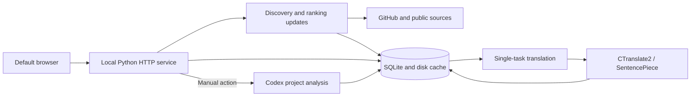

<p align="center">
  
</p>

<h1 align="center">StarTrail</h1>
<p align="center">Discover open-source projects, understand their purpose, and keep the ones worth following locally.</p>
<p align="center">
  <a href="https://github.com/AetheriusLumina/StarTrail/releases/tag/v0.4.0-preview.1">Download for Windows</a> ·
  <a href="docs/USER_GUIDE.md">User guide (Chinese)</a> ·
  <a href="docs/DEVELOPMENT.md">Development guide (Chinese)</a> ·
  <a href="https://github.com/AetheriusLumina/StarTrail/issues">Report an issue</a> ·
  <a href="README.md">简体中文</a>
</p>
<p align="center">
  <a href="LICENSE"></a>
</p>

StarTrail is a **Windows x64-first local application**. It discovers public GitHub repositories, verifies daily Star growth, finds projects by keyword, and supports ongoing reading through explanations, a history calendar, and follow folders.

1. **Discover**: growth and keyword results preserve their ranking and make room for new discoveries.
2. **Understand**: six information panels explain purpose, features, scenarios, and requirements, with plain-language explanations of technical terms.
3. **Organize**: history, follows, and translations stay on your computer, with search and folders.

> [!TIP]
> Basic browsing does not require AI. The installer includes the runtime and offline English/Chinese models. **Local translation uses no AI tokens**; project AI analysis is a separate manual action using your own Codex connection and account allowance.

The current release is an **unsigned 0.4.0 Windows preview**. Automated regression checks and Windows cloud builds have been verified; clean Windows installs, other computers, and long-running use still need further testing.

**Navigation**: [Get started](#download-and-get-started) · [The story](#how-this-project-started) · [Features](#features-and-interface) · [Data and privacy](#data-and-privacy) · [Development](#development-and-contributing) · [Progress](#progress-and-next-steps) · [License](#license-and-acknowledgments)

## Download and get started

End users do not need to install Python, Node.js, or development tools.

1. Open the [Windows release](https://github.com/AetheriusLumina/StarTrail/releases/tag/v0.4.0-preview.1) and download **StarTrail_Setup.exe**. The same page includes the user guide and SHA256 checksums.
2. Install and launch the shortcut. The interface opens in your default browser.
3. Click the sidebar update action, add keywords, and switch saved results through the category bar.
4. Open a project to read its details and follow it. Use History and Follows to search, revisit, and organize projects.
5. Connect Codex only when you want AI analysis. Basic features remain available without a connection.

<details>
<summary>Upgrading and the complete user guide</summary>

1. Existing GitHub Radar users should install into the location containing their existing data and keep `UserData`. The display name changed; internal compatibility identifiers remain.
2. Installation, updating, exit behavior, and troubleshooting are covered in the [user guide (Chinese)](docs/USER_GUIDE.md). Browsers may prevent automatic tab closing; close the product tab manually when necessary.
3. Source code is in this repository; installers are in Releases. End users do not need a development environment.

</details>

## How this project started

The original idea was a GitHub project reader worth opening every day: find interesting projects, understand what they do, and organize the ones worth keeping.

Starting with no programming background, development began by describing requirements in natural language and using [OpenAI Codex](https://openai.com/codex/) and AI to implement and debug them. Hands-on use guided changes to the interface, ranking rules, and reading experience. The product was originally called GitHub Radar and was renamed **StarTrail** for its open-source release, while preserving compatibility with existing data.

Sharing the source makes it possible for more people to use the application and for developers to understand, review, and improve its implementation.

<details>
<summary>Development process and design decisions</summary>

1. **Clarify the requirements**: refine discovery, understanding, and organization; distinguish growth rankings from keyword recommendations, and define ranking positions, historical deduplication, and slots for new discoveries.
2. **Improve through actual use**: organize details into six equal cards, make calendar dates open separate daily views, and use compact follow cards; align transparent styling, typography, menus, and short transitions.
3. **Address observed problems**: investigate manual updates, expired authentication, statistical dates, and concurrent tasks; prepare translations before showing details to avoid repeated work and late text replacement.
4. **Prepare for public use and development**: organize source, documentation, and resource licenses; set up an isolated environment, public-file checks, regression tests, and Windows builds.
5. **Record the collaboration process**: some stages used [Superpowers](https://github.com/obra/superpowers) for requirement clarification, planning, debugging, testing, and review; [UI/UX Pro Max](https://github.com/nextlevelbuilder/ui-ux-pro-max-skill) (`ui-ux-pro-max`) supported layout, typography, themes, and interaction details, alongside image generation/editing and interface inspection skills. These are development aids, not runtime dependencies; extensive AI involvement still requires practical verification and code review.

You can contribute reproducible feedback, wording, or translations without programming experience. Developers are welcome to help with code review, performance measurements, and compatibility.

</details>

## Features and interface

These screenshots show actual use with saved history. Rankings, Star counts, dates, and project explanations reflect saved results at capture time. Click an image to view it at full size.

### 1. Discover projects: growth and keywords

**Preserve ranking positions and leave room for new discoveries.** Growth results verify daily new Stars and show repeated historical projects compactly. Keyword results use current filtering conditions rather than rotating fixed rank ranges each day.


<details>
<summary>Growth rankings and update rules</summary>

1. Growth uses the latest completed UTC day, rather than treating a popular site's display order as growth data.
2. Previously seen projects in the current top five use compact cards showing name, rank, total Stars, and new Stars.
3. Those repeated projects do not use the five new-discovery slots. The application continues looking for verified candidates not already in history.
4. If candidates are insufficient, the network fails, or the request budget is exhausted, the result reports that condition. It does not invent projects or relabel old data with a new date.
5. Manual update starts work without waiting for the scheduler. Repeated clicks reuse an active update rather than starting parallel copies.

</details>

<details>
<summary>Keyword sorting and deduplication</summary>

1. Add a topic of interest and adjust its minimum Star threshold or enabled state in Settings. The default threshold is 1,000 Stars.
2. Candidates are filtered using current conditions, including total Stars, and deduplicated against history. Results are not mechanically rotated from yesterday's top five to today's ranks six through ten.
3. Original candidate positions are retained: if rank five is new but rank six appeared before, the results may show ranks five, seven, eight, nine, and ten.
4. Projects are also deduplicated against the current growth results and earlier keyword groups. If fewer than five qualify, the actual number is shown.
5. The home page defaults to Star growth. Switching keywords reads that group's saved results without fetching again or invoking AI. Returning from details preserves the selected category; the vertical three-dot menu exposes all keywords.
6. Optional keyword AI actions are manual and use the connected account's allowance, just like project analysis.

</details>

### 2. Understand projects: six information panels

**Original purpose, problem solved, intended audience, core features, typical scenarios, and requirements** are presented separately. The six equal cards use three columns and two rows; long content scrolls within each card.


<details>
<summary>Project explanations and available actions</summary>

1. Rank, name, and actions share a compact row, followed by Star data and the description. You can open the original repository, update its README, or follow the project.
2. Original purpose is taken from the repository README. The other five panels are manually generated from public information and cached; missing analysis is not presented as completed work.
3. AI prompts request plain language and explanations of technical terms. You can choose a model, regenerate the analysis, or switch to original text.
4. Analysis uses AI; translating existing content uses the local engine. Both can be wrong. Check the original repository before installation, permission changes, or deployment.

</details>

### 3. Revisit history: dates and combined search

The calendar shows saved project counts by day. Clicking a recorded date opens a separate daily view. Search supports names, saved content, date ranges, and sources.


<details>
<summary>History behavior</summary>

1. Select a year and month or move between adjacent months. Open a date with records and return to the calendar afterward.
2. History preserves snapshots from that time instead of overwriting past ranks and data with today's numbers.
3. Search displays matching projects directly and disables calendar interaction; clearing filters returns to the calendar.
4. Projects use compact five-column cards, with each keyword group starting on a new row.

</details>

### 4. Follow projects: search and folders

Compact follow cards, custom folders, and name or description search help organize interesting projects.


<details>
<summary>Folder and organization actions</summary>

1. All follows, Uncategorized, and custom folders show project counts. The desktop layout displays five cards per row and wraps additional cards.
2. Click a folder name to select it. Its rightmost vertical three-dot menu provides rename and delete actions; clicking elsewhere closes the menu.
3. Custom folders support drag sorting, and uncategorized projects can be dragged into folders. Project dragging is unavailable in All follows.
4. Deleting a folder keeps its followed projects; it does not unfollow them.

</details>

### 5. Prepare translations: one task and disk caching

Selected projects have their detail translations prepared in background batches. Unchanged content reuses the cache; repeatedly opening, closing, or switching views does not translate the whole document again.

<details>
<summary>Translation and resource usage</summary>

1. Only selected projects are pretranslated, not every search candidate. AI content is not generated automatically.
2. One task runs at a time. Translations and content fingerprints are stored on disk and reused when content is unchanged.
3. Historical projects may be translated on first opening, and updated AI explanations can be translated after generation.
4. Required translations are prepared before details appear, reducing late text replacement. Code, links, and repository identifiers remain unchanged.
5. Translation uses CPU models and does not require a GPU. Worker processes exit after preparation. Initial setup and long documents can still take time.

</details>

### 6. Reading experience: transparent styling and short transitions

The forest background, transparent cards, menus, and scrollbars follow one theme. Titles and ranks use serif typography. A fixed-width sidebar supports larger text through vertical scrolling when needed.

<details>
<summary>Reading preferences and interaction</summary>

1. Opening, returning, and category changes reveal real page elements in about 350ms. Static areas do not replay their animation; reduced-motion preferences are available.
2. Settings manage reading preferences, keywords, daily run time, and GitHub/Codex connection status.
3. Windows scheduled tasks support automatic updates, and the default browser provides the interface. Exit stops the local application; close the product tab manually if the browser blocks automatic closing.

</details>

## Data and privacy

> [!IMPORTANT]
> Growth rankings cover candidates successfully discovered and verified in the current run. **They are not a real-time ranking of all GitHub repositories.** Statistics use completed UTC days, and the interface distinguishes save dates from statistical dates.

History, follows, settings, and translations stay on your computer. Fetching public information and manually invoking AI have different data boundaries.

<details>
<summary>Sources, statistical dates, and ranking scope</summary>

| No. | Information | Source and handling | Scope and limitations |
|---|---|---|---|
| 1 | Name, description, language, Topics, total Stars | Public GitHub repository information | Data at retrieval time, which can be later than the growth day |
| 2 | Daily new Stars | GitHub's daily Star history, checked for complete UTC days and consistency | Missing, delayed, or failed data is not marked as verified |
| 3 | Candidate discovery | GitHub search and partitioned search, public activity samples, recent growth, tracked projects, and GitHub Trending / Trendshift pages | Expands candidate coverage; activity counts and display order are not official new-Star counts |
| 4 | Original purpose | The original README | External text is read and translated, never executed |
| 5 | Five project explanations | Manual Codex analysis of public information | Model explanations may be incomplete or wrong and are not a repository author's guarantee |
| 6 | History and follows | Local SQLite snapshots and saved records | Local storage, not cloud synchronization |

1. **Statistical days use UTC, not local midnight.** In UTC+8, yesterday's complete UTC day ends at 08:00 today. Before that time, the latest complete UTC day is the day before yesterday. The interface separates save dates and statistical dates.
2. Network conditions, GitHub rate limits, source availability, and per-run budgets affect coverage. Source and candidate/verification counts and limitations remain visible at the end of each list. Signing in to GitHub generally increases the request allowance.
3. StarTrail is independent of GitHub, Trendshift, and recommended repositories. Public interfaces and pages can change and need ongoing adaptation.

</details>

<details>
<summary>Local storage, requests, and security boundaries</summary>

| No. | Action | Stored locally | External requests or data sent |
|---|---|---|---|
| 1 | History, follows, folders, settings, translations | Database and configuration in `UserData` | No project-operated cloud sync service |
| 2 | Fetch projects and READMEs | Retrieved results and cache | Necessary requests to GitHub and candidate sources, including repository identifiers and keywords |
| 3 | Local translation | Text is processed by a local worker | No cloud text submission for translation; development setup initially downloads models |
| 4 | Manual AI analysis | Returned explanations | Keywords, public information, or README excerpts sent through the connected Codex account, using its allowance |
| 5 | GitHub sign-in | Credentials encrypted for the Windows account | GitHub's authorization flow and API requests |

1. The service listens only on loopback and checks session credentials and origins for mutable actions. READMEs are untrusted text; their scripts or commands are never executed.
2. Do not expose the local port publicly or share `UserData`, tokens, authorization files, full logs, or screenshots containing personal records. Encrypted storage does not replace operating-system account security.
3. The public repository starts from safe source, without private acceptance history, databases, credentials, build caches, or machine configuration. `.venv`, `.tools`, `.build`, and `UserData` are ignored. The public-file scanner supplements, rather than replaces, staged-file review.

</details>

## Development and contributing

The application uses a **Python standard-library backend, native HTML/CSS/JavaScript, and SQLite**. Modules have distinct responsibilities, and existing data and runtime identifiers remain compatible. The [development guide (Chinese)](docs/DEVELOPMENT.md) provides complete maintenance rules. See the [development log (Chinese)](docs/CHANGELOG.md) for changes and the [AI handoff guide (Chinese)](docs/AI_HANDOFF.md) before continuing development.

<details>
<summary>Architecture, directory layout, and change entry points</summary>



```text
StarTrail/
├── github_radar/               # Python application; legacy name for compatibility
│   ├── __main__.py             # Startup, parameters, maintenance
│   ├── browser_server.py       # Local HTTP API and page serving
│   ├── service.py              # Update coordination and saving
│   ├── ranking.py              # Sorting and deduplication
│   ├── storage.py              # SQLite, history, follows, caches
│   ├── project_translation.py  # Detail pretranslation for selected projects
│   ├── translation_worker.py   # Independent CPU translation worker
│   ├── ai_service.py           # Manual project analysis
│   └── web_assets/             # UI, styling, interaction, fonts, icons
├── tests/                     # Offline regression tests and synthetic fixtures
├── scripts/                   # Model preparation and public-file checks
├── requirements/              # Dependency constraints
├── packaging/                 # Build scripts, installer, model manifest
├── docs/                      # Guides, licenses, screenshots
├── .github/                   # Checks, manual releases, feedback templates
├── pyproject.toml             # Version, dependencies, package configuration
└── LICENSE                    # MIT license for original code
```

| No. | Change | Entry points within `github_radar/` |
|---|---|---|
| 1 | Ranking and new discoveries | `ranking.py`, `daily_update.py`, `service.py` |
| 2 | Candidate sources and GitHub changes | `discovery.py`, `github_client.py`, `trending.py`, `trendshift.py` |
| 3 | Layout, theme, transitions | `web_assets/index.html`, `app.css`, `app.js`, `card_transition.js` |
| 4 | Calendar, follows, folders | `history_search.py`, `follow_folders.py`, and corresponding web modules |
| 5 | README, pretranslation, caching | `readme_service.py`, `project_translation.py`, `translation_service.py` |
| 6 | AI prompts and connections | `ai_service.py`, `ai_provider.py`, `codex_connection.py` |
| 7 | Windows scheduling, startup, uninstall | `windows_scheduler.py`, `browser_launcher.py`, `uninstall.py` |

Argos-sourced English/Chinese models use CPU int8 inference through CTranslate2 and SentencePiece. PyInstaller freezes the application; Inno Setup produces the Windows installer.

</details>

<details>
<summary>Run from source</summary>

Prepare Windows x64, Python 3.13 x64, Node.js 22+, and Git. Node.js is used for interaction tests; end users do not need these tools.

```powershell
git clone https://github.com/AetheriusLumina/StarTrail.git
cd StarTrail
py -3.13 -m venv .venv
.\.venv\Scripts\python -m pip install -c requirements/constraints.txt -e ".[translation]"
.\.venv\Scripts\python scripts/prepare_models.py
.\.venv\Scripts\python -m github_radar --data-dir .build/DevelopmentData
```

1. Initial model downloads verify the manifest's source and SHA256. Translation then runs offline.
2. Development data is separate from installed application data to avoid modifying everyday records. Model reuse, device authorization configuration, and environment options are in the [development environment guide (Chinese)](docs/DEVELOPMENT.md#开发环境).

</details>

<details>
<summary>Tests, Windows builds, and manual releases</summary>

Tests use synthetic data and temporary directories, without private credentials or paid AI calls. The main branch has **481 automated tests**, including Node.js interface checks.

```powershell
$env:RADAR_TEST_PYTHON = (Resolve-Path .venv/Scripts/python.exe).Path
.\.venv\Scripts\python -m unittest discover -s tests
.\.venv\Scripts\python scripts/check_public.py --tracked
git diff --check
```

Install official Inno Setup 6 before building:

```powershell
.\.venv\Scripts\python -m pip install -c requirements/constraints.txt -e ".[translation,build]"
.\.venv\Scripts\python scripts/prepare_models.py
pwsh -File packaging/build.ps1
```

1. Output is `.build/StarTrail_Setup.exe`. Use `-IsccPath` when the compiler is in another location; model sources, dependency constraints, and third-party licenses are checked during the build.
2. Ordinary pushes and PRs run read-only Windows checks. Installer builds/releases are manual: an empty tag uploads artifacts only; an existing tag is checked out, tested, built, and uploaded, with the server-side installer digest verified before publication as a preview.
3. The manual task uses `contents: write`, never publishes on ordinary pushes or external PRs, and requires the target tag and Release draft to exist. It does not create or rewrite tags.
4. Successful builds are not a substitute for real installation testing. See the [build guide (Chinese)](docs/DEVELOPMENT.md#windows-安装包) for details and compatibility identifiers.

</details>

<details>
<summary>Report issues and contribute changes</summary>

1. In [Issues](https://github.com/AetheriusLumina/StarTrail/issues), include version, reproduction steps, expected behavior, and actual behavior. Redact personal records; do not post tokens, databases, or full personal logs.
2. Discuss larger feature or algorithm changes first: who benefits, what problem is solved, and how existing data is affected.
3. Fork, create a short-lived branch, make focused changes, run relevant regressions and public-file checks, then open a PR.
4. Explain behavior changes, validation, and limitations. Comments should describe reasons and constraints rather than repeat the code. See [contribution conventions (Chinese)](docs/DEVELOPMENT.md#贡献与维护约定) and the [security policy (Chinese)](.github/SECURITY.md).

</details>

## Progress and next steps

Public source, bilingual introductions, actual screenshots, development entry points, and a Windows preview installer are organized. Completed work is distinguished from testing still needed.

<details>
<summary>Completed work</summary>

1. Growth verification, keyword deduplication, six-panel details, history search, and follow folders are implemented.
2. Single-task local pretranslation, disk caches, real-element transitions, and transparent reading styles are in place.
3. Public-file checks, 481 automated regressions, Windows cloud checks, and installer builds have verification records.
4. Frozen-program startup in a Chinese-character path, isolated data writes, and bidirectional offline CPU translation have been verified. The downloaded public installer checksum has been checked.
5. User/developer guides, code layout, maintenance conventions, and third-party licenses are organized, with legacy GitHub Radar data compatibility preserved.

</details>

<details>
<summary>Current limitations and next steps</summary>

1. Windows x64 is the first supported target. Support for macOS, Linux, ARM, and mobile is not promised.
2. The preview is unsigned. Clean Windows installs, a second computer, real authorization renewal across days, and long-running use need further verification.
3. Sources may rate-limit, delay, or change. Failures retain saved results and report limitations; history is not a real-time monitoring service.
4. Measure long-README translation quality, duration, and peak memory. The recorded short-sentence worker baseline is not a whole-product memory claim; see [performance notes (Chinese)](docs/DEVELOPMENT.md#内存与性能).
5. AI and translations can be wrong. Original text and repository links remain available for checking.
6. Prioritize compatibility, performance baselines, interface adaptation, and gradual modularization rather than an unverified framework rewrite.

</details>

## License and acknowledgments

Original code and documentation use [MIT](LICENSE), allowing use, modification, and distribution while retaining the license notice. Fonts, models, backgrounds, and libraries keep their own licenses; see [third-party and resource notices (Chinese)](docs/THIRD_PARTY_NOTICES.md). The original cat-and-starlight icon is not GitHub's official Octocat trademark.

Thanks to the open-source tools and resource projects, and to repository authors who make their information public.
