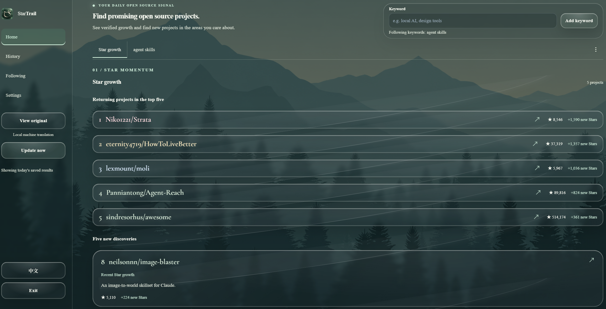
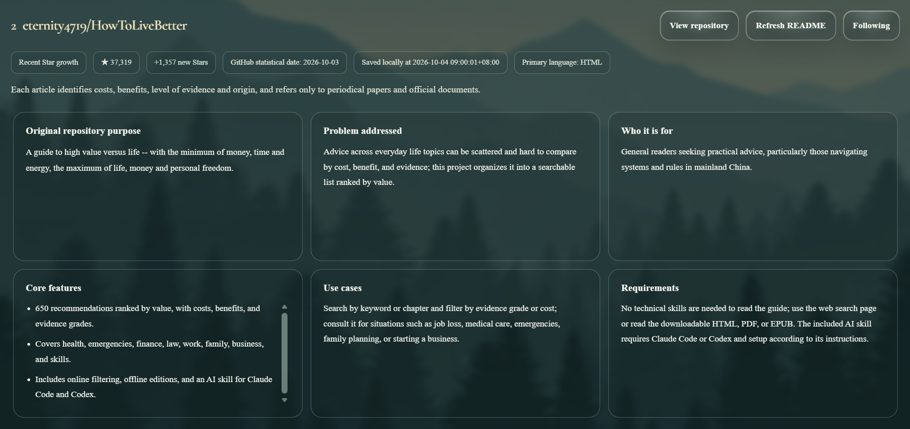
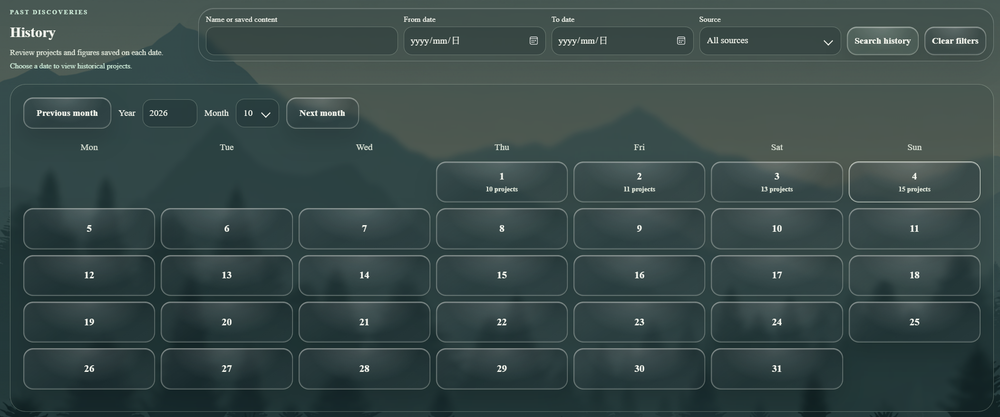
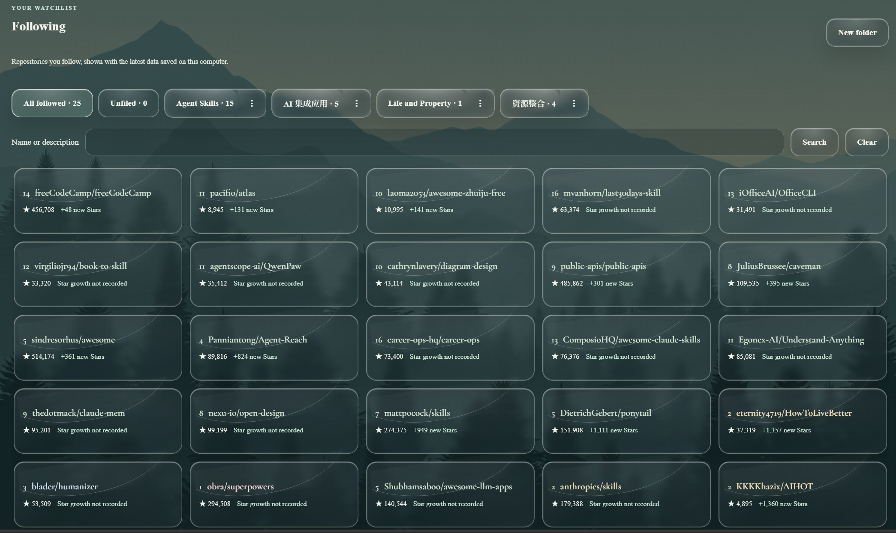
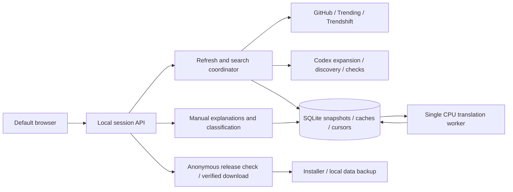

<p align="center"></p>
<h1 align="center">StarTrail</h1>
<p align="center">Discover open-source projects, understand what they do, and keep the interesting ones locally.</p>
<p align="center"><a href="https://github.com/AetheriusLumina/StarTrail/releases">Download for Windows</a> · <a href="docs/USER_GUIDE.md">User guide</a> · <a href="docs/DEVELOPMENT.md">Development guide</a> · <a href="https://github.com/AetheriusLumina/StarTrail/issues">Report an issue</a> · <a href="README.md">中文</a></p>
<p align="center"><a href="LICENSE"></a></p>

Finding an interesting repository is only the beginning: understanding what it is and keeping track of it matter too. StarTrail brings **discovery, understanding, and organization** together in a Windows-first local reader, opened in the default browser.

1. **Discover:** merge public sources with Codex-assisted query expansion, active web search, and evidence checks; use separate ranking rules for growth and keywords.
2. **Understand:** six plain-language sections explain purpose, problems, audience, features, scenarios, and requirements. The first purpose line highlights the project type.
3. **Organize:** revisit dated snapshots, follow projects, search folders, drag cards between categories, or classify directly from any detail page.

> [!TIP]
> The installer includes the runtime and offline Chinese/English models. **Local translation uses no AI quota.** Basic discovery and reading work without Codex. With Codex connected, project updates automatically run AI search and checks using the connected account's quota; full project explanations remain manual.

**Navigation:** [Get started](#download-and-get-started) · [The story](#how-this-project-started) · [Features](#features-and-interface) · [Data and privacy](#data-and-privacy) · [Development](#development-and-contributions) · [Limitations](#limitations-and-next-directions) · [License](#license-and-thanks)

## Download and get started

No Python, Node.js, or development tools are needed to use the installer.

1. Download **StarTrail_Setup.exe** from [Releases](https://github.com/AetheriusLumina/StarTrail/releases). The same page provides SHA256 checksums and the user guide.
2. Install and launch through the desktop shortcut. The reader opens in the default browser.
3. Use **Update now**, add a keyword, and switch between Star growth and keyword results.
4. Open a project, generate an explanation when needed, and follow or classify it. Revisit History and Following later.
5. Settings manage keywords, text size, motion, scheduled updates, GitHub authorization, and Codex connection.

<details>
<summary>Software upgrades and existing data</summary>

1. Anonymous startup and periodic checks look for a newer release with both a complete installer and a valid SHA256 checksum.
2. A notification appears at the top for ten seconds and can be closed manually. The Software update button stays in the sidebar.
3. Confirm before downloading. Size and SHA256 are checked during download and again before launching the installer. The installer stops the reader, backs up UserData, then replaces app files.
4. A manually downloaded installer follows the same upgrade procedure, recognizes the existing installation, and preserves data. Internal GitHub Radar identifiers remain for compatibility.
5. Update now fetches project data; Software update upgrades the application. Source runs link to the installer rather than replacing the development checkout. See the [user guide](docs/USER_GUIDE.md) for installation and recovery details.

</details>

## How this project started

The starting idea was a GitHub reader worth opening every day: find useful projects, understand them, and keep the interesting ones organized.

Starting with no programming background, the requirements were expressed in everyday language and developed with [OpenAI Codex](https://openai.com/codex/). Real use supplied the feedback: screenshots of misaligned elements, confusing descriptions, repeated translation, and failed updates. Discussing the causes, revising the rules, and checking the actual behavior gradually turned the idea into StarTrail.

Opening the source makes it possible to use the app directly, examine the implementation, and help improve it.

<details>
<summary>Communication methods and design decisions</summary>

1. Describe the problem first: distinguish the two rankings, define dates and deduplication, and specify the expected action rather than only asking for a better look.
2. Make feedback concrete: identify a location in a screenshot, discuss the mechanism, then implement and check it through actual use.
3. Set boundaries for AI: preserve existing data and behavior, verify public facts, report failures honestly, and use caches and budgets for paid work.
4. Keep the process recoverable: plans, a unified engineering log, API contracts, tests, and resource notices let another developer or AI continue without the old chat.
5. Use tools alongside verification: [Superpowers](https://github.com/obra/superpowers) supports requirements, planning, debugging, testing, and review; [UI/UX Pro Max](https://github.com/nextlevelbuilder/ui-ux-pro-max-skill) (`ui-ux-pro-max`) supports layout, typography, and interaction. Image generation and interface checks assist design and acceptance. These are development tools, not runtime dependencies.

</details>

## Features and interface

These are actual usage screenshots. Projects, dates, rankings, and figures reflect the results saved at capture time. Click an image to view it larger.

### 1. Discover projects: growth and keywords

**Growth ranks by verified daily additions; keywords rank by relevance and total Stars.** Both merge GitHub, public trend sources, and active AI discovery with traceable repository identities and facts.



<details>
<summary>Search, verification, ranking, and quota rules</summary>

1. Growth candidates come from public GitHub searches, recent projects, activity samples, tracked repositories, GitHub Trending, Trendshift, and active AI web discovery. Popularity signals discover candidates; they do not replace daily Star counts.
2. The authoritative growth metric is a positive daily addition from GitHub statistics for the latest complete UTC day. AI checks identity, dates, and metric meaning. Sort by daily additions, total Stars, then repository identity.
3. Previously displayed projects in the growth top five appear as compact returning entries without consuming the five new-discovery slots.
4. Keyword expansion preserves the original term and adds a few bilingual synonyms and applicable Trendshift topics. The expanded terms can be inspected and corrected in the interface.
5. GitHub searches names, descriptions, and READMEs using those terms. Public trend pages and AI web searches supply additional candidates. Official metadata resolves identities, refreshes total Stars, and merges duplicates.
6. Verify substantive relevance before sorting by official total Stars. Apply the minimum-Star threshold and archive filter, exclude previously displayed projects and other modules' occupied slots, and keep merely collected candidates eligible for later discovery.
7. Refresh facts daily while reusing unchanged semantic judgments from disk. Check at most twenty repositories per batch and two hundred new judgments per module per day by default. Repeated updates do not reset usage. Manual continuation can add up to two hundred judgments.
8. When new results are insufficient, allow at most one additional AI gap search within the task budget, then merge and rerank. Rate limits, incomplete pages, failures, and insufficient candidates remain visible; exhaustive coverage of all relevant GitHub repositories is not promised.
9. Switching saved pages does not run discovery. Update now is independent of the scheduled time, and duplicate clicks reuse the running update.

</details>

### 2. Understand projects: six useful sections

**Original purpose, problem addressed, audience, core features, use cases, and requirements** each have their own card. The equal three-by-two layout scrolls long content inside the cards.



<details>
<summary>Project types, explanations, and classification</summary>

1. Manually generated AI explanations use plain language and explain technical terms. A highlighted first line identifies the project as software, a Skill, an algorithm, a framework, reference material, or another type; insufficient evidence stays uncertain.
2. Without an explanation, readable repository purpose remains available. Older cached explanations are retained and can be regenerated manually to add the type.
3. The upper-right actions open the repository, refresh its README, follow it, or classify it. Classification works from Home, keywords, History, and Following; select multiple folders or create one. Saving follows the project, while cancellation changes nothing.
4. README text and model explanations assist reading; installation, permissions, and deployment instructions still need checking against the original repository.

</details>

### 3. Revisit history: dates and combined search

The calendar shows saved project counts. Open a date to read its snapshot, or combine name, saved content, date range, and source filters.



<details>
<summary>Snapshot and search behavior</summary>

1. Browse years, months, and adjacent months; returning preserves the reading position.
2. Historical results use the corresponding dated snapshot. Current figures never overwrite past rankings, and cached old content is not labeled as a fresh observation.
3. Searching shows matching cards directly; clearing filters restores the calendar. Keyword groups begin on separate rows.

</details>

### 4. Follow projects: folders, search, and dragging

Compact cards, folder counts, and name/description search keep a growing reading list manageable.



<details>
<summary>Folder operations</summary>

1. All followed, Unfiled, and custom folders show their own counts. Custom folders support ordering, renaming, and deletion.
2. Cards in All followed do not drag. Cards in Unfiled and custom folders can be dragged to another category.
3. Moving between custom folders removes only the source membership and preserves other memberships. Moving to Unfiled clears memberships but keeps the follow.
4. Deleting a folder preserves its followed projects. Detail pages support direct multi-folder classification without an extra Move to button below each card.

</details>

### 5. Prepare translations: one worker and disk caches

Selected projects have their detail translations prepared in the background. Unchanged content reuses its cache instead of being translated again after every navigation.

<details>
<summary>Translation and resource use</summary>

1. Prepare selected projects only, one local translation task at a time. Content fingerprints and translations live on disk; the entire candidate collection is not loaded into a translator.
2. Historical details can be translated on first opening, and changed AI explanations can be translated afterwards. Pretranslation does not generate AI explanations.
3. Prepare required text before revealing the detail page, reducing sudden text changes after the animation. Keep code, links, and repository identifiers intact.
4. CPU int8 models require no GPU, and the worker is released after completing work. Initial preparation and long content can still take time; original text remains available.

</details>

### 6. Read comfortably: forest theme and short motion

The forest background, translucent cards, menus, and scrollbars share a consistent theme. Titles and ranks use a serif font; the sidebar width remains fixed when text grows.

<details>
<summary>Reading and update settings</summary>

1. Opening, returning, and switching use approximately 350ms reveals of real elements. The old view leaves immediately; static headers do not replay. Motion can be reduced.
2. Settings cover typography, motion, keywords, scheduled refreshes, GitHub authorization, and Codex connection.
3. The software-version notice dismisses after ten seconds. Installer confirmation stays separate from project-data updates.
4. Reading uses the default browser. Exit stops the local service; a tab may need manual closing if browser rules prevent programmatic closure.

</details>

## Data and privacy

> [!IMPORTANT]
> The growth list covers successfully discovered and verified candidates, **not a real-time ranking of all GitHub**. Daily additions, total Stars, trend-page rankings, and AI judgments are distinct signals.

<details>
<summary>Dates and source boundaries</summary>

1. Daily additions use complete UTC days; saved dates use local time. For example, after 08:00 in UTC+8 on October 4, the latest complete UTC day is October 3; before 08:00 that day is not complete yet.
2. Official GitHub metadata supplies identity and total Stars; official statistics supply daily additions. GitHub Trending, Trendshift, public activity, and AI discovery broaden the candidate pool.
3. Topics and trends are finite. READMEs are untrusted content to read, not instructions to execute. AI discovery requires observed live-search events, followed by official repository resolution.
4. Project explanations are model interpretations of public material rather than guarantees from the original author. History is saved local data, not continuous monitoring.

</details>

<details>
<summary>Local storage and outgoing requests</summary>

| No. | Operation | Boundary |
|---|---|---|
| 1 | History, follows, folders, preferences, translations | Stored in UserData; no project-operated cloud synchronization |
| 2 | Discovery and README refresh | Public keywords and repository identifiers are queried against GitHub and public sources |
| 3 | Local translation | Text stays in the local CPU worker; translation itself does not upload it |
| 4 | Automatic AI discovery/checks and manual explanations | Public terms and repository material go to the connected Codex account, using its quota |
| 5 | GitHub authorization | Device authorization; credentials protected with Windows user-bound encryption |
| 6 | Software upgrades | Anonymous fixed-repository release requests; no database or personal-log upload |

The server listens on loopback and checks session credentials and request origin. Do not expose its port or share UserData, tokens, authorization files, or full personal logs. Public source excludes private databases, credentials, environments, build caches, and personal acceptance records. Automated scanning assists review but cannot replace it.

</details>

## Development and contributions

**Python's standard library + native HTML/CSS/JavaScript + SQLite**, organized by responsibility while preserving installation and data compatibility. See the [development guide](docs/DEVELOPMENT.md), [API and AI handoff](docs/AI_HANDOFF.md), and [engineering log](docs/CHANGELOG.md).

<details>
<summary>Architecture and code map</summary>



| No. | Responsibility | Entry points under github_radar/ |
|---|---|---|
| 1 | Startup and session API | __main__.py, browser_server.py |
| 2 | Automatic and manual discovery | search_jobs.py, search_coordinator.py, service.py |
| 3 | Public sources and AI discovery | search_sources.py, search_provider.py, codex_runner.py |
| 4 | Judgments, quotas, leases, and ranking | search_storage.py, search_types.py, search_ranking.py |
| 5 | Snapshots, history, folders | storage.py, history_search.py, follow_folders.py |
| 6 | Manual explanations and offline preparation | ai_service.py, project_translation.py, translation_worker.py |
| 7 | Software upgrade and interface | software_update.py, web_assets/ |

tests/ contains isolated regressions; scripts/ holds model preparation and public checks; requirements/ pins dependencies; packaging/ builds the installer; docs/ contains manuals, contracts, logs, notices, and localized screenshots; .github/ contains checks, manual publication, and issue templates.

Translation uses Argos-source bilingual models, CTranslate2, and SentencePiece. PyInstaller freezes the application and Inno Setup creates the Windows installer. Resource licensing is centralized in [third-party notices](docs/THIRD_PARTY_NOTICES.md).

</details>

<details>
<summary>Run, verify, build, and contribute</summary>

1. Use Windows x64, Python 3.13, Node.js 22+, and Git for development. Installer users do not need them.
2. Keep development data separate. Tests use synthetic material and temporary directories, without private credentials or paid AI calls.

```powershell
git clone https://github.com/AetheriusLumina/StarTrail.git
cd StarTrail
py -3.13 -m venv .venv
.\.venv\Scripts\python -m pip install -c requirements/constraints.txt -e ".[translation,build]"
.\.venv\Scripts\python scripts/prepare_models.py
.\.venv\Scripts\python -m github_radar --data-dir .build/DevelopmentData
```

```powershell
$env:RADAR_TEST_PYTHON = (Resolve-Path .venv/Scripts/python.exe).Path
.\.venv\Scripts\python -m unittest discover -s tests
node tests/software_update_ui.cjs
.\.venv\Scripts\python scripts/check_public.py --tracked
git diff --check
```

3. With official Inno Setup 6, run `pwsh -File packaging/build.ps1`. Generated files stay in .build. Consult the development guide for pinned dependencies and model verification.
4. Normal commits and PRs run read-only checks. Authorized maintainers manually build and publish a specified tag after tests, public-file checks, and asset-digest verification.
5. Contributions can start with issue reports, copy edits, translations, review, or performance work. Discuss substantial changes first and explain behavior, validation, and limitations in each PR. Never include private data.

</details>

## Limitations and next directions

1. Windows x64 comes first; macOS, Linux, ARM, and mobile need further adaptation. The installer is unsigned, and clean-machine and long-running coverage need continued expansion.
2. Public sources can change, lag, or impose rate limits. Budgets broaden discovery while preserving honest limits and resumable work; exhaustive coverage is not promised.
3. AI and machine translation can be wrong. Local models use disk and temporary memory; long-README quality and performance remain areas to improve.
4. Compatibility, performance, source adaptation, and incremental module improvements take priority. Testing and review contributions are welcome.

## License and thanks

Original code and documentation use the [MIT License](LICENSE). Fonts, models, background artwork, and runtime libraries retain their respective licenses; see [third-party notices](docs/THIRD_PARTY_NOTICES.md). The original cat-and-starlight icon is not GitHub's official Octocat trademark.

Thanks to the open-source tools and resources, and to repository authors who make their work public.
