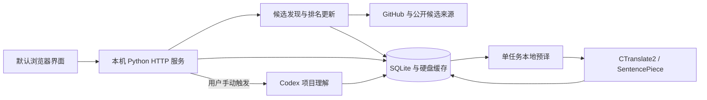

<p align="center">
  
</p>

<h1 align="center">星迹 · StarTrail</h1>
<p align="center">发现开源项目，读懂它能做什么，把值得关注的项目留在本机。</p>
<p align="center">
  <a href="https://github.com/AetheriusLumina/StarTrail/releases/tag/v0.4.0-preview.1">下载 Windows 预览版</a> ·
  <a href="docs/USER_GUIDE.md">用户手册</a> ·
  <a href="docs/DEVELOPMENT.md">开发指南</a> ·
  <a href="https://github.com/AetheriusLumina/StarTrail/issues">反馈问题</a> ·
  <a href="README.en.md">English</a>
</p>

<p align="center">
  <a href="LICENSE"></a>
</p>

StarTrail 是优先适配 **Windows x64** 的本地应用。从公开 GitHub 项目中发现候选、核实每日 Star 增长，按关键词寻找新项目，再通过中文说明、历史日历和关注文件夹持续阅读。

1. **发现**：增长榜与关键词推荐保留真实排名，给新发现留出位置。
2. **理解**：六项信息说明用途、功能、场景和门槛，专业术语补充解释。
3. **整理**：历史、关注和译文保存在本机，支持搜索与文件夹分类。

> [!TIP]
> 基础浏览无需 AI。安装版自带运行环境与中英离线模型，**本地翻译不消耗 AI token**；项目 AI 分析单独手动触发，使用自己的 Codex 连接与账号额度。

当前为 **0.4.0 Windows 预览版**，尚未代码签名。自动回归和 Windows 云端构建已有验证；干净 Windows、不同电脑和长期运行仍需继续核对。

**阅读导航**：[开始使用](#下载与开始使用) · [创作背景](#这个项目如何诞生) · [功能与界面](#功能与界面) · [数据与隐私](#数据与隐私) · [开发与贡献](#开发与贡献) · [进展与计划](#当前进展与后续计划) · [许可证](#许可证与致谢)

## 下载与开始使用

普通用户不需要安装 Python、Node.js 或开发工具。

1. 打开 [Windows 下载页](https://github.com/AetheriusLumina/StarTrail/releases/tag/v0.4.0-preview.1)，下载 **StarTrail_Setup.exe**；同页还有用户手册和 SHA256 校验文件。
2. 安装后通过快捷方式启动，界面会在默认浏览器打开。
3. 点击左侧「立即更新」获取项目；添加感兴趣的关键词，在上方分类栏切换 Star 增长与关键词结果。
4. 点击项目阅读详情，点击「关注」收藏；在「历史」和「我的关注」中回看、搜索和整理。
5. 需要 AI 分析时再连接 Codex。首次未连接时照常使用基础功能。

<details>
<summary>查看升级兼容与完整手册</summary>

安装、更新、退出及常见问题见 [用户手册](docs/USER_GUIDE.md)。升级旧 GitHub Radar 用户时，请使用已有数据的安装位置并保留 `UserData`；产品显示名已更新，内部兼容标识仍保留。源码与安装包分别发布：Git 仓库存源码，Releases 放安装包。

</details>

## 这个项目如何诞生

最初只是想做一个愿意每天打开的 GitHub 项目阅读工具：发现值得关注的项目，读懂用途，再把感兴趣的内容整理起来。

从编程零基础开始，用自然语言提出需求，借助 [OpenAI Codex](https://openai.com/codex/) 与 AI 完成编码和调试，通过实际试用不断调整界面、排名规则和阅读体验。产品早期叫 GitHub Radar，开源时更名为 **星迹 · StarTrail**，并保留旧数据兼容入口。

公开源码，希望更多人能直接使用，也方便开发者看懂代码、审查实现和继续改进。

<details>
<summary>展开开发过程与设计取舍</summary>

1. **把需求说清楚**：围绕发现、理解和整理逐步细化规则，区分增长榜与关键词推荐，明确真实排名、历史排重和新发现名额。
2. **边用边调整**：把详情整理为等大的六张卡片，历史日期进入独立当天页，关注紧凑排列；统一透明主题、字体、菜单和短动效。
3. **修复实际问题**：检查手动更新、登录失效、统计日期与并发任务；提前准备译文，避免切页后反复翻译和替换文字。
4. **准备公开使用与开发**：整理源码、文档和资源授权，建立独立环境、公开文件检查、自动回归与 Windows 构建流程。
5. **记录协作方式**：部分阶段使用 [Superpowers](https://github.com/obra/superpowers) 的需求澄清、计划、调试、测试与复核流程，借助 [UI/UX Pro Max](https://github.com/nextlevelbuilder/ui-ux-pro-max-skill)（`ui-ux-pro-max`）处理布局、字体、主题和交互细节，也使用图像生成与编辑、界面检查等技能辅助图标设计和验收。这些属于开发工具，不是运行依赖；AI 深度参与仍需实际验证和代码审查。

不熟悉编程也可以从反馈问题、修改文案或翻译开始；熟悉开发的朋友欢迎参与代码审查、性能实测和兼容性改进。

</details>

## 功能与界面

下面是有历史记录时的实际使用界面。排名、Star 数、日期和项目理解以截图时保存的结果为准；点击图片可查看大图。

### 1. 发现项目：增长榜与关键词

**保留真实排名，给新发现留出位置。** 增长榜核实每日新增 Star，历史重复项目紧凑展示；关键词按当前条件筛选，不按天机械轮换名次。


<details>
<summary>展开增长榜与更新规则</summary>

1. 以最近已结束的完整 UTC 日计算新增 Star，而不是把某个热门网站的展示顺序当成增长数字。
2. 当前增长榜前五中出现过的历史项目，用只保留名称、排名、总 Star 和新增 Star 的紧凑卡展示。
3. 这些历史重复项目不占「五个新发现」的名额；继续从已核实候选中寻找与历史不重复的项目。
4. 候选不足、网络失败或请求预算用完时如实显示情况，不编造第五个项目，不把旧数据改成新日期。
5. 点击「立即更新」主动发起更新，不需要等待定时任务；重复点击复用正在运行的更新，避免同时启动多份任务。

</details>

<details>
<summary>展开关键词排序与排重规则</summary>

1. 添加你关心的方向，并在设置中调整最低 Star 门槛和启用状态。默认门槛为 1,000 Star。
2. 候选按当前总 Star 等条件筛选，历史排重；不会按「昨天前五、今天第六到第十」机械翻页。
3. 排名保留候选原有位置。比如第五名是新的、第六名以前已出现，就可能展示第五、第七、第八、第九、第十名。
4. 项目还会与当次增长结果及前面关键词组排重，减少相同项目占用多个位置。不足五个时显示实际数量。
5. 首页默认选择「Star 增长」，切换关键词查看该组已保存结果；切换本身不重新抓取，也不自动调用 AI。从详情返回保留原分类。
6. 可选的关键词 AI 操作与项目 AI 分析一样，明确由用户触发并使用个人账号额度。

</details>

### 2. 读懂项目：六项关键信息

**仓库原用途、解决的问题、适合谁、核心功能、典型场景、使用门槛**分别介绍。三列两行的六张卡片等大，长内容在卡片内滚动。


<details>
<summary>展开项目理解与操作说明</summary>

1. 排名、名称和操作按钮同行，Star 数据与简介紧凑排列；可以查看原仓库、更新 README 或关注项目。
2. 「仓库原用途」读取原仓库 README。其他五项信息通过手动「生成项目理解」基于公开资料生成并缓存；没有结果时不会假装完成分析。
3. AI 提示词要求用大白话解释，专业术语补充含义；可以选择模型、重新生成理解或切换原文。
4. 生成分析需要 AI，翻译已有内容使用本地引擎。两者都可能出错，实际安装、权限或部署仍应核对原仓库。

</details>

### 3. 回看历史：日期与组合搜索

日历显示每天保存的项目数，点击日期进入独立当天页；也可以按名称、已保存内容、日期范围和来源搜索。


<details>
<summary>展开历史查看规则</summary>

1. 按年份和月份查看记录，或切换相邻月份；有记录的日期进入当天页，再返回日历。
2. 历史保存当时的项目快照，不用今天的数字覆盖过去的排名和数据。
3. 搜索直接展示匹配项目，此时日历不可交互；清空条件后返回日历。
4. 项目使用五列紧凑卡，关键词组另起一行。

</details>

### 4. 持续关注：搜索与文件夹

关注项目用紧凑卡片展示，自建文件夹配合名称或简介搜索，方便整理感兴趣的项目。


<details>
<summary>展开文件夹与整理操作</summary>

1. 支持「全部关注」「未分类」和自建文件夹，按钮显示项目数；桌面每行五张卡，超过五个另起一行。
2. 点击文件夹名字切换分类，最右侧竖三点提供重命名、删除，点击其他位置收回菜单。
3. 自建文件夹可拖动排序，未分类项目可拖入文件夹；「全部关注」入口不提供项目拖动。
4. 删除文件夹保留关注项目，不等于取消关注。

</details>

### 5. 提前翻译：单任务与硬盘缓存

入选项目在后台分批准备详情译文，内容不变就复用缓存；重复打开、关闭或切页不整份重新翻译。

<details>
<summary>展开翻译与资源使用方式</summary>

1. 入选项目在后台分批准备详情译文，而不是切换页面时整份重新翻译。
2. 一次处理一个翻译任务，译文和内容指纹存到硬盘；内容没变就复用缓存。
3. 不预译所有搜索候选，不自动生成 AI 内容；历史项目首次打开可补译，已更新的 AI 说明也会补译。
4. 展开详情前准备需要的译文，减少动画结束后文字突然替换。代码、链接与仓库标识保留原样。
5. 翻译使用 CPU 模型，不要求显卡；准备任务完成后释放工作进程。首次模型准备和长文翻译仍可能需要等待。

</details>

### 6. 阅读体验：透明主题与短动效

森林背景、透明卡片、菜单和滚动条保持一致。标题与排名使用衬线字体；固定侧栏配合字号调整，必要时纵向滚动。

<details>
<summary>展开阅读设置与交互说明</summary>

1. 点击、返回与分类切换使用真实页面元素渐显，正常约 350ms；静态区域不反复重播，可在设置减少动效。
2. 设置管理阅读偏好、关键词、每日运行时间、GitHub 与 Codex 连接状态。
3. Windows 定时任务用于自动更新，默认浏览器用于阅读；退出结束本地程序，浏览器限制关页时手动关闭产品标签。

</details>

## 数据与隐私

> [!IMPORTANT]
> 增长榜覆盖本次成功发现并核实的候选，**不代表 GitHub 全站实时总榜**。统计采用完整 UTC 日；界面区分保存日期与统计日期。

历史、关注、设置和译文保存在本机；联网获取资料和手动 AI 分析有不同的数据边界。

<details>
<summary>查看数据来源、统计日与排名口径</summary>

| 序号 | 信息 | 来源与处理 | 需要注意 |
|---|---|---|---|
| 1 | 仓库名称、描述、语言、Topics、总 Star | GitHub 公开仓库资料 | 是获取时的数据，可能晚于增长统计日 |
| 2 | 每日新增 Star | GitHub 返回的 Star 按日历史，经过完整 UTC 日与一致性校验 | 接口或数据可能缺失、延迟或变化；失败项目不冒充已核实 |
| 3 | 候选发现 | GitHub 搜索与分区搜索、公开活动样本、近期增长、已跟踪项目，以及 GitHub Trending / Trendshift 等公开页面 | 这些来源扩大候选范围；活动数量和网站榜单不是官方新增 Star |
| 4 | 仓库原用途 | 原仓库 README | README 是不可信外部文本，只阅读和翻译，不执行其中命令或脚本 |
| 5 | 五项项目理解 | 用户手动调用 Codex，基于公开仓库资料生成 | 属于模型解释，可能不完整或错误，不是仓库作者的保证 |
| 6 | 历史与关注 | 本机 SQLite 快照与保存记录 | 不上传到本项目仓库，不是云同步 |

**统计日采用 UTC，而不是用户电脑的本地午夜。** 例如北京时间 10 月 3 日 08:00 之后，最近完整统计日是 UTC 10 月 2 日 00:00–24:00；在北京时间 08:00 之前，UTC 10 月 2 日还没结束，最近完整日仍为 10 月 1 日。界面会区分保存日期与统计日期。

增长榜根据本次已发现、成功核算的项目排序。网络条件、GitHub 限流、来源可用性和单次预算都会影响覆盖；列表末尾保留来源、候选数量、成功核算数量及限制说明。GitHub 未登录请求也有限额，连接自己的账号通常能获得更高请求额度。

StarTrail 是独立项目，不隶属于 GitHub、Trendshift 或各推荐项目。公开接口和页面可能改变，后续会持续适配与回归。

</details>

<details>
<summary>查看本地存储与对外请求</summary>

| 序号 | 操作 | 留在本机 | 对外请求或发送 |
|---|---|---|---|
| 1 | 历史、关注、文件夹、设置、译文缓存 | `UserData` 内的数据库与配置 | 没有项目自建的云同步服务 |
| 2 | 获取项目与 README | 保存获取结果 | 向 GitHub 和候选来源发出必要查询，包括仓库标识、关键词等 |
| 3 | 本地机器翻译 | 文本在本地翻译进程中处理 | 翻译本身不发送文本到云端；开发环境首次准备模型需要下载模型 |
| 4 | 手动 AI 分析 | 保存返回的理解结果 | 将关键词、公开仓库资料或 README 片段交给所连接的 Codex；使用你自己的账号额度 |
| 5 | GitHub 登录 | Windows 账号绑定的加密凭证 | 通过 GitHub 授权流程访问相应接口 |

本机服务只监听回环地址，界面可变操作核对会话凭证和来源。不要把本机服务端口暴露到公网。加密存储不能代替电脑账号安全：不要分享 `UserData`、Token、授权文件、完整日志或含个人记录的截图。

公开仓库从当前安全源码建立，**不包含过去的个人验收历史、数据库、凭证、构建缓存或本机配置**。`.venv`、`.tools`、`.build` 和 `UserData` 都忽略；提交前另有公开文件扫描。扫描不是绝对保证，贡献者仍需逐项检查暂存区。

</details>

## 开发与贡献

采用 **Python 标准库后端 + 原生 HTML/CSS/JavaScript + SQLite**。按职责组织模块，保留现有数据和运行身份，方便逐步修改。完整维护规则见 [开发指南](docs/DEVELOPMENT.md)。

<details>
<summary>查看架构图、代码目录与修改入口</summary>

当前选择 **Python 标准库后端 + 原生 HTML/CSS/JavaScript + SQLite**。没有要求贡献者先学习大型前端框架；界面和后端按职责分模块，后续可以逐步拆分，避免为了换框架破坏已有行为。



翻译模型使用 Argos 来源的中英/英中模型，CPU int8 推理由 CTranslate2 与 SentencePiece 完成。安装版由 PyInstaller 冻结，再由 Inno Setup 生成 Windows 安装器。

```text
StarTrail/
├── github_radar/               # Python 应用；旧包名保留兼容
│   ├── __main__.py             # 启动、参数与维护入口
│   ├── browser_server.py       # 本机 HTTP API 与页面服务
│   ├── service.py              # 更新协调与结果保存
│   ├── ranking.py              # 增长、关键词排序及排重
│   ├── storage.py              # SQLite、历史、关注与缓存
│   ├── project_translation.py  # 入选项目详情预译
│   ├── translation_worker.py   # 独立 CPU 翻译工作进程
│   ├── ai_service.py           # 手动项目理解
│   └── web_assets/             # 页面、样式、交互、字体与图标
├── tests/                     # 离线回归与合成夹具
├── scripts/                   # 模型准备、公开文件检查
├── requirements/              # 依赖约束
├── packaging/                 # 打包脚本、安装器、模型清单
├── docs/                      # 用户手册、开发指南、授权和截图
├── .github/                   # 检查、手动构建发布与反馈模板
├── pyproject.toml             # 版本、依赖与安装配置
└── LICENSE                    # 自有代码 MIT 许可证
```

**想改哪里，先看这里：**

| 序号 | 想做的修改 | 入口（均位于 `github_radar/`） |
|---|---|---|
| 1 | 调整排序和新发现规则 | `ranking.py`、`daily_update.py`、`service.py` |
| 2 | 新增候选来源、适配 GitHub 变化 | `discovery.py`、`github_client.py`、`trending.py`、`trendshift.py` |
| 3 | 修改页面布局、主题和动效 | `web_assets/index.html`、`app.css`、`app.js`、`card_transition.js` |
| 4 | 日历、关注与文件夹 | `history_search.py`、`follow_folders.py`，及对应网页模块 |
| 5 | 调整 README、预译与缓存 | `readme_service.py`、`project_translation.py`、`translation_service.py` |
| 6 | 修改 AI 提示词和连接 | `ai_service.py`、`ai_provider.py`、`codex_connection.py` |
| 7 | Windows 定时、启动和卸载 | `windows_scheduler.py`、`browser_launcher.py`、`uninstall.py` |

详细数据流、开发约束和打包步骤见 [开发指南](docs/DEVELOPMENT.md)。

</details>

<details>
<summary>展开开发启动命令</summary>

需要 **Windows x64、Python 3.13 x64、Node.js 22+、Git**。Node.js 用于交互回归测试；安装版用户无需这些工具。

```powershell
git clone https://github.com/AetheriusLumina/StarTrail.git
cd StarTrail
py -3.13 -m venv .venv
.\.venv\Scripts\python -m pip install -c requirements/constraints.txt -e ".[translation]"
.\.venv\Scripts\python scripts/prepare_models.py
.\.venv\Scripts\python -m github_radar --data-dir .build/DevelopmentData
```

首次下载模型会核对清单中的来源与 SHA256，之后翻译离线运行。开发数据与安装版数据分开，避免调试时改到日常记录。复用已下载模型、配置自己的 GitHub 设备授权应用和其他启动说明见 [开发环境](docs/DEVELOPMENT.md#开发环境)。

</details>

<details>
<summary>查看测试、打包与发布步骤</summary>

自动测试使用合成数据和临时目录，不需要私人凭证，也不会付费调用 AI。当前主分支有 **481 项自动测试**，其中包含通过 Node.js 执行的界面交互检查。

```powershell
$env:RADAR_TEST_PYTHON = (Resolve-Path .venv/Scripts/python.exe).Path
.\.venv\Scripts\python -m unittest discover -s tests
.\.venv\Scripts\python scripts/check_public.py --tracked
git diff --check
```

生成安装包需要官方 Inno Setup 6：

```powershell
.\.venv\Scripts\python -m pip install -c requirements/constraints.txt -e ".[translation,build]"
.\.venv\Scripts\python scripts/prepare_models.py
pwsh -File packaging/build.ps1
```

结果在 `.build/StarTrail_Setup.exe`。编译器位置不同可通过 `-IsccPath` 指定；模型来源、依赖约束和第三方许可证随构建检查。

GitHub 的普通提交和 PR 只运行只读 Windows 检查。**安装包构建与发布仅通过有权限的人手动触发**：不填写版本标签时只上传构建产物；填写已有标签时检出该标签、运行检查和测试、准备模型并打包，上传安装包、手册与 SHA256，核对服务端安装包摘要后公开预览版。该手动任务使用仓库 `contents: write` 权限，不在普通提交或外部 PR 中发布。发布前先创建目标标签与草稿，核对范围后再触发。

</details>

<details>
<summary>展开参与方式</summary>

欢迎修复问题、改进说明、添加回归测试和提交功能提案。无需先成为项目专家。

1. **报告问题**：在 [Issues](https://github.com/AetheriusLumina/StarTrail/issues) 写清版本、操作步骤、预期结果和实际结果；截图前遮住个人记录。不要贴 Token、数据库或完整个人日志。
2. **讨论功能**：说明谁会使用、解决什么问题、是否影响现有排序或数据。较大的交互和算法变化先讨论。
3. **提交修改**：Fork → 建立短分支 → 小范围修改 → 运行相关回归与公开文件检查 → 提交 PR。
4. **写清验证**：解释改变后的行为、测试方式和仍未验证的情况；注释写约束与原因，避免只复述代码。

开发约定集中在 [开发指南](docs/DEVELOPMENT.md#贡献与维护约定)，漏洞报告见 [安全说明](.github/SECURITY.md)。个人验收记录和旧安装包留在仓库外，避免不断增加版本报告文件。

</details>

## 当前进展与后续计划

已整理公开源码、双语介绍、实际截图、开发入口与 Windows 预览安装包。这里区分已完成工作与待验证事项，方便继续改进。

<details>
<summary>已完成的工作</summary>

1. 增长核算、关键词排重、六项详情、历史搜索与关注文件夹已实现。
2. 本地单任务预译、硬盘缓存、真实元素短动效和透明阅读主题已整理。
3. 公开文件检查、481 项自动回归、Windows 云端检查与安装包构建已有验证记录。
4. 冻结程序的中文目录启动、独立数据写入和双向 CPU 离线翻译已验证；公开安装包下载哈希已核对。
5. 整理用户手册、代码目录、维护约定与第三方授权，保留旧 GitHub Radar 数据兼容入口。

</details>

<details>
<summary>查看当前限制与后续方向</summary>

1. 当前优先支持 Windows x64，macOS、Linux、ARM 和移动端没有支持承诺。
2. 首次公开版未签名；完整干净 Windows、第二台电脑、真实授权跨夜续期及长期运行验收仍待补充。
3. GitHub 和候选页面可能限流、延迟或改版；网络失败时保留已保存结果，并显示限制。历史不是实时监控服务。
4. 本地模型会占用磁盘和短时内存；长 README 的翻译质量、耗时和峰值应继续测量。短句翻译进程基线见 [性能说明](docs/DEVELOPMENT.md#内存与性能)，不是整产品内存承诺。
5. AI 理解可能解释错，机器翻译也可能不准确；始终可以查看原文并核对原仓库。
6. 后续优先完善干净 Windows 验证、性能基线、接口适配和有边界的模块拆分，而不是未经验证整体换框架。

</details>

## 许可证与致谢

自有代码和文档采用 [MIT](LICENSE)，允许使用、修改和分发，并保留许可说明。字体、模型、背景与运行库保留各自授权，详见 [第三方与资源说明](docs/THIRD_PARTY_NOTICES.md)。原创猫形星光图标不是 GitHub 官方 Octocat 商标。

感谢相关开源工具与资源项目，以及提供公开资料的仓库作者。
