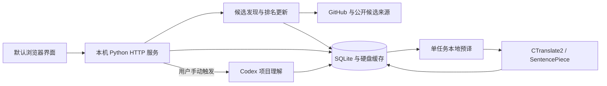

<p align="center">
  
</p>

<h1 align="center">星迹 · StarTrail</h1>
<p align="center">发现开源项目，读懂它能做什么，把值得关注的项目留在本机。</p>
<p align="center">
  <a href="https://github.com/AetheriusLumina/StarTrail/releases/tag/v0.4.0-preview.2">下载 Windows 预览版</a> ·
  <a href="docs/USER_GUIDE.md">用户手册</a> ·
  <a href="docs/DEVELOPMENT.md">开发指南</a> ·
  <a href="https://github.com/AetheriusLumina/StarTrail/issues">反馈问题</a>
</p>

[](https://github.com/AetheriusLumina/StarTrail/actions/workflows/check.yml)
[](LICENSE)

StarTrail 是优先适配 **Windows x64** 的本地应用。它从公开 GitHub 项目中发现候选，核实每日 Star 增长，按关键词寻找新项目，再用历史日历、关注文件夹和中文说明帮助你持续阅读。

安装版自带 Python 运行环境和中英离线翻译模型，界面在默认浏览器里打开。**基础浏览不需要连接 AI；机器翻译在本机运行，不消耗 AI token。** AI 项目分析是可选的手动操作，使用你自己的 Codex 连接与账号额度。

StarTrail is a Windows-first, local reader for public GitHub projects: verified daily Star growth, keyword discovery, a history calendar, folders, and offline Chinese/English translation. Optional AI explanations use your own Codex connection. This is an independent project, not an official GitHub product.

> 当前发布为 **0.4.0 Windows 预览版**，尚未代码签名。已完成自动回归和 Windows 云端构建；不同电脑、干净 Windows 安装及长期运行仍需要更多反馈。榜单覆盖本次成功发现并核实的候选，不能理解为 GitHub 全站实时总榜。

## 目录

- [下载与开始使用](#下载与开始使用)
- [界面预览](#界面预览)
- [功能详解](#功能详解)
- [数据来源与排名规则](#数据来源与排名规则)
- [本地数据与隐私](#本地数据与隐私)
- [这个项目如何诞生](#这个项目如何诞生)
- [技术架构与代码目录](#技术架构与代码目录)
- [从源码运行](#从源码运行)
- [测试构建与发布](#测试构建与发布)
- [参与开发](#参与开发)
- [限制与下一步](#限制与下一步)
- [许可证与致谢](#许可证与致谢)

## 下载与开始使用

普通用户不需要安装 Python、Node.js 或开发工具。

1. 打开 [Windows 下载页](https://github.com/AetheriusLumina/StarTrail/releases/tag/v0.4.0-preview.2)，下载 **StarTrail_Setup.exe**；同页还有用户手册和 SHA256 校验文件。
2. 安装后通过快捷方式启动，界面会在默认浏览器打开。
3. 点击左侧「立即更新」获取项目；添加感兴趣的关键词，在上方分类栏切换 Star 增长与关键词结果。
4. 点击项目阅读详情，点击「关注」收藏；在「历史」和「我的关注」中回看、搜索和整理。
5. 需要 AI 分析时再连接 Codex。首次未连接时照常使用基础功能。

安装、更新、退出及常见问题见 [用户手册](docs/USER_GUIDE.md)。升级旧 GitHub Radar 用户时，请使用已有数据的安装位置并保留 `UserData`；产品显示名已更新，内部兼容标识仍保留。源码与安装包分别发布：Git 仓库存源码，Releases 放安装包。

## 界面预览

以下四张图由维护者提供并授权公开，来自软件的实际使用界面，保留原始画面。部分截图仍显示旧名称 **GitHub Radar**；产品现已更名为 **星迹 · StarTrail**，这些功能继续保留。排名、Star 数、日期和项目理解代表截图时保存的结果，**不是实时榜单或原仓库保证**。截图仅用于介绍功能，不包含登录凭证或电脑文件路径。点击图片可查看大图。

### 首页：增长与关键词分类

关键词添加位于右上方，分类栏在项目列表上方。切换分类读取已保存结果，右侧竖三点可展开全部关键词。图中前五的历史项目保留原排名并用小卡展示；下方继续列出「五个新发现」，重复历史项目不占新增名额。


### 项目详情：六项关键信息

标题与排名、操作按钮、Star 数据和简介紧凑排列；六卡为三列两行，内容过长时在卡内滚动。原用途取自仓库 README，其余信息可手动生成并缓存。图中的「核心功能」展示了卡内滚动条：长内容不把六个卡片撑成不同高度；专业项目也能按用途、场景和门槛逐项阅读。


### 历史：按日期回看与组合搜索

日历按月份显示已有记录，每一天可看到保存的项目数。选择年份和月份或切换相邻月份，点击有记录的日期进入独立当天页；上方名称、日期范围和来源支持组合搜索，搜索时日历不可交互。


### 我的关注：紧凑卡片与文件夹

关注项目按五列显示，超过五个自动另起一行。图中「全部关注」「未分类」与自建文件夹同行，按钮显示项目数；竖三点提供重命名、删除，文件夹可拖动排序。名称或简介搜索帮助快速找到收藏；删除文件夹保留关注项目。


## 功能详解

### 发现增长项目，同时留出新发现名额

- 以最近已结束的完整 UTC 日计算新增 Star，而不是把某个热门网站的展示顺序当成增长数字。
- 当前增长榜前五中出现过的历史项目，用只保留名称、排名、总 Star 和新增 Star 的紧凑卡展示。
- 这些历史重复项目不占「五个新发现」的名额；继续从已核实候选中寻找与历史不重复的项目。
- 候选不足、网络失败或请求预算用完时如实显示情况，不编造第五个项目，不把旧数据改成新日期。
- 点击「立即更新」主动发起更新，不需要等待定时任务；重复点击复用正在运行的更新，避免同时启动多份任务。

### 关键词推荐按当前条件重新排序

- 添加你关心的方向，并在设置中调整最低 Star 门槛和启用状态。默认门槛为 1,000 Star。
- 候选按当前总 Star 等条件筛选，历史排重；不会按「昨天前五、今天第六到第十」机械翻页。
- 排名保留候选原有位置。比如第五名是新的、第六名以前已出现，就可能展示第五、第七、第八、第九、第十名。
- 项目还会与当次增长结果及前面关键词组排重，减少相同项目占用多个位置。不足五个时显示实际数量。
- 首页默认选择「Star 增长」，切换关键词查看该组已保存结果；切换本身不重新抓取，也不自动调用 AI。从详情返回保留原分类。
- 可选的关键词 AI 操作与项目 AI 分析一样，明确由用户触发并使用个人账号额度。

### 六项信息帮助普通用户读懂项目

详情展示：**仓库原用途、解决的问题、适合谁、核心功能、典型场景、使用门槛**。

「仓库原用途」读取原仓库 README，不用 AI 凭空改写用途。其余信息由手动「生成项目理解」根据公开仓库资料生成；没有缓存时不会假装已完成分析。提示词要求用大白话解释，遇到专业术语补充说明。你可以更新 README、切换原文、选择模型或重新生成理解。

分析与翻译分开：生成分析需要 AI；把已有 README 和说明翻译成中文或英文使用本地引擎。生成结果可能出错，涉及实际安装、权限或部署时仍应核对原仓库。

### 提前翻译，缓存后重复阅读

- 入选项目在后台分批准备详情译文，而不是切换页面时整份重新翻译。
- 一次处理一个翻译任务，译文和内容指纹存到硬盘；内容没变就复用缓存。
- 不预译所有搜索候选，不自动生成 AI 内容；历史项目首次打开可补译，已更新的 AI 说明也会补译。
- 展开详情前准备需要的译文，减少动画结束后文字突然替换。代码、链接与仓库标识保留原样。
- 翻译使用 CPU 模型，不要求显卡；准备任务完成后释放工作进程。首次模型准备和长文翻译仍可能需要等待。

### 历史与关注整理

历史保存当天项目快照，方便回看当时的排名和数据，而不是用今天的数字覆盖历史。日历点击日期进入当天页；搜索结果直接展示并禁用日历交互，清空条件后返回日历。项目以五列紧凑卡展示，关键词组另起一行。

「我的关注」支持全部关注搜索、未分类入口、自建文件夹、文件夹菜单和拖动排序。可以把未分类项目拖入文件夹；全部关注入口不提供项目拖动。删除文件夹保留已关注项目，不等于删除关注。

### 阅读体验与 Windows 使用

森林背景、透明玻璃卡片、主题菜单与滚动条保持一致；标题和排名使用书卷感衬线字体，正文以阅读为先。点击、返回和分类切换使用真实页面元素渐显，正常动效约 350ms；减少动效设置可降低动态效果。侧栏宽度固定，字号放大主要增加纵向空间，必要时滚动。

设置包括阅读偏好、关键词、每日运行时间、GitHub 和 Codex 连接状态。Windows 定时任务用于自动更新；退出结束本地程序。普通浏览器有关闭页面的限制，必要时手动关闭产品标签页。

## 数据来源与排名规则

| 信息 | 来源与处理 | 需要注意 |
|---|---|---|
| 仓库名称、描述、语言、Topics、总 Star | GitHub 公开仓库资料 | 是获取时的数据，可能晚于增长统计日 |
| 每日新增 Star | GitHub 返回的 Star 按日历史，经过完整 UTC 日与一致性校验 | 接口或数据可能缺失、延迟或变化；失败项目不冒充已核实 |
| 候选发现 | GitHub 搜索与分区搜索、公开活动样本、近期增长、已跟踪项目，以及 GitHub Trending / Trendshift 等公开页面 | 这些来源扩大候选范围；活动数量和网站榜单不是官方新增 Star |
| 仓库原用途 | 原仓库 README | README 是不可信外部文本，只阅读和翻译，不执行其中命令或脚本 |
| 五项项目理解 | 用户手动调用 Codex，基于公开仓库资料生成 | 属于模型解释，可能不完整或错误，不是仓库作者的保证 |
| 历史与关注 | 本机 SQLite 快照与保存记录 | 不上传到本项目仓库，不是云同步 |

**统计日采用 UTC，而不是用户电脑的本地午夜。** 例如北京时间 10 月 3 日 08:00 之后，最近完整统计日是 UTC 10 月 2 日 00:00–24:00；在北京时间 08:00 之前，UTC 10 月 2 日还没结束，最近完整日仍为 10 月 1 日。界面会区分保存日期与统计日期。

增长榜根据本次已发现、成功核算的项目排序。网络条件、GitHub 限流、来源可用性和单次预算都会影响覆盖；列表末尾保留来源、候选数量、成功核算数量及限制说明。GitHub 未登录请求也有限额，连接自己的账号通常能获得更高请求额度。

StarTrail 不隶属于 GitHub、Trendshift 或各推荐项目；公开接口和页面可能改变，维护者需要持续回归。

## 本地数据与隐私

| 操作 | 留在本机 | 对外请求或发送 |
|---|---|---|
| 历史、关注、文件夹、设置、译文缓存 | `UserData` 内的数据库与配置 | 没有项目自建的云同步服务 |
| 获取项目与 README | 保存获取结果 | 向 GitHub 和候选来源发出必要查询，包括仓库标识、关键词等 |
| 本地机器翻译 | 文本在本地翻译进程中处理 | 翻译本身不发送文本到云端；开发环境首次准备模型需要下载模型 |
| 手动 AI 分析 | 保存返回的理解结果 | 将关键词、公开仓库资料或 README 片段交给所连接的 Codex；使用你自己的账号额度 |
| GitHub 登录 | Windows 账号绑定的加密凭证 | 通过 GitHub 授权流程访问相应接口 |

本机服务只监听回环地址，界面可变操作核对会话凭证和来源。不要把本机服务端口暴露到公网。加密存储不能代替电脑账号安全：不要分享 `UserData`、Token、授权文件、完整日志或含个人记录的截图。

公开仓库从当前安全源码建立，**不包含过去的个人验收历史、数据库、凭证、构建缓存或维护者电脑配置**。`.venv`、`.tools`、`.build` 和 `UserData` 都忽略；提交前另有公开文件扫描。扫描不是绝对保证，贡献者仍需逐项检查暂存区。

## 这个项目如何诞生

这个项目由 **AetheriusLumina** 发起。发起者是编程初学者，希望有一款自己愿意每天打开、能读懂、能整理的 GitHub 项目阅读工具，因此选择用自然语言描述需求，并让 AI 协助推进整个开发过程。

开发过程采用 Codex 与 AI 编程协作：AI 参与需求拆解、设计讨论、编码、调试、自动测试、界面核对、文档整理和 Windows 打包；发起者提出具体规则、实际试用、指出不合适的行为，再确认修改结果。产品早期叫 GitHub Radar，开源时更名为 StarTrail，保留旧数据兼容入口。

这是一份 **由初学者发起、AI 深度参与、持续人工试用的开源项目**。公开代码让其他开发者能审查实现、修正问题、替换自己需要的模块。AI 参与不等于代码已经完美，也不意味着项目中使用的字体、模型和背景都由 AI 创作；相关授权单独说明。

如果你也不熟悉编程，可以先提出可复现的问题、改进文案或翻译；如果你熟悉开发，欢迎帮忙做代码审查、性能实测和更完整的 Windows 验证。

## 技术架构与代码目录

当前选择 **Python 标准库后端 + 原生 HTML/CSS/JavaScript + SQLite**。没有要求贡献者先学习大型前端框架；界面和后端按职责分模块，后续可以逐步拆分，避免为了换框架破坏已有行为。



翻译模型使用 Argos 来源的中英/英中模型，CPU int8 推理由 CTranslate2 与 SentencePiece 完成。安装版由 PyInstaller 冻结，再由 Inno Setup 生成 Windows 安装器。

```text
StarTrail/
├── github_radar/               # Python 应用；旧包名保留兼容
│   ├── __main__.py             # 启动、参数与维护入口
│   ├── browser_server.py       # 本机 HTTP API 与页面服务
│   ├── service.py              # 更新协调与结果保存
│   ├── ranking.py              # 增长、关键词排序及排重
│   ├── storage.py              # SQLite、历史、关注与缓存
│   ├── project_translation.py  # 入选项目详情预译
│   ├── translation_worker.py   # 独立 CPU 翻译工作进程
│   ├── ai_service.py           # 手动项目理解
│   └── web_assets/             # 页面、样式、交互、字体与图标
├── tests/                     # 离线回归与合成夹具
├── scripts/                   # 模型准备、公开文件检查
├── requirements/              # 依赖约束
├── packaging/                 # 打包脚本、安装器、模型清单
├── docs/                      # 用户手册、开发指南、授权和截图
├── .github/                   # 检查、手动构建发布与反馈模板
├── pyproject.toml             # 版本、依赖与安装配置
└── LICENSE                    # 自有代码 MIT 许可证
```

**想改哪里，先看这里：**

| 想做的修改 | 入口（均位于 `github_radar/`） |
|---|---|
| 调整排序和新发现规则 | `ranking.py`、`daily_update.py`、`service.py` |
| 新增候选来源、适配 GitHub 变化 | `discovery.py`、`github_client.py`、`trending.py`、`trendshift.py` |
| 修改页面布局、主题和动效 | `web_assets/index.html`、`app.css`、`app.js`、`card_transition.js` |
| 日历、关注与文件夹 | `history_search.py`、`follow_folders.py`，及对应网页模块 |
| 调整 README、预译与缓存 | `readme_service.py`、`project_translation.py`、`translation_service.py` |
| 修改 AI 提示词和连接 | `ai_service.py`、`ai_provider.py`、`codex_connection.py` |
| Windows 定时、启动和卸载 | `windows_scheduler.py`、`browser_launcher.py`、`uninstall.py` |

详细数据流、开发约束和打包步骤见 [开发指南](docs/DEVELOPMENT.md)。

## 从源码运行

需要 **Windows x64、Python 3.13 x64、Node.js 22+、Git**。Node.js 用于交互回归测试；安装版用户无需这些工具。

```powershell
git clone https://github.com/AetheriusLumina/StarTrail.git
cd StarTrail
py -3.13 -m venv .venv
.\.venv\Scripts\python -m pip install -c requirements/constraints.txt -e ".[translation]"
.\.venv\Scripts\python scripts/prepare_models.py
.\.venv\Scripts\python -m github_radar --data-dir .build/DevelopmentData
```

首次下载模型会核对清单中的来源与 SHA256，之后翻译离线运行。开发数据与安装版数据分开，避免调试时改到日常记录。复用已下载模型、配置自己的 GitHub 设备授权应用和其他启动说明见 [开发环境](docs/DEVELOPMENT.md#开发环境)。

## 测试构建与发布

自动测试使用合成数据和临时目录，不需要私人凭证，也不会付费调用 AI。当前发布代码有 **481 项自动测试**，其中包含通过 Node.js 执行的界面交互检查。

```powershell
$env:RADAR_TEST_PYTHON = (Resolve-Path .venv/Scripts/python.exe).Path
.\.venv\Scripts\python -m unittest discover -s tests
.\.venv\Scripts\python scripts/check_public.py --tracked
git diff --check
```

生成安装包需要官方 Inno Setup 6：

```powershell
.\.venv\Scripts\python -m pip install -c requirements/constraints.txt -e ".[translation,build]"
.\.venv\Scripts\python scripts/prepare_models.py
pwsh -File packaging/build.ps1
```

结果在 `.build/StarTrail_Setup.exe`。编译器位置不同可通过 `-IsccPath` 指定；模型来源、依赖约束和第三方许可证随构建检查。

GitHub 的普通提交和 PR 只运行只读 Windows 检查。**安装包构建与发布仅通过有权限的人手动触发**：不填写版本标签时只上传构建产物；填写已有标签时检出该标签、运行检查和测试、准备模型并打包，上传安装包、手册与 SHA256，核对服务端安装包摘要后公开预览版。该手动任务使用仓库 `contents: write` 权限，不在普通提交或外部 PR 中发布。维护者应先创建目标标签与发布草稿，核对范围后再触发。

## 参与开发

欢迎修复问题、改进说明、添加回归测试和提交功能提案。无需先成为项目专家。

1. **报告问题**：在 [Issues](https://github.com/AetheriusLumina/StarTrail/issues) 写清版本、操作步骤、预期结果和实际结果；截图前遮住个人记录。不要贴 Token、数据库或完整个人日志。
2. **讨论功能**：说明谁会使用、解决什么问题、是否影响现有排序或数据。较大的交互和算法变化先讨论。
3. **提交修改**：Fork → 建立短分支 → 小范围修改 → 运行相关回归与公开文件检查 → 提交 PR。
4. **写清验证**：解释改变后的行为、测试方式和仍未验证的情况；注释写约束与原因，避免只复述代码。

开发约定集中在 [开发指南](docs/DEVELOPMENT.md#贡献与维护约定)，漏洞报告见 [安全说明](.github/SECURITY.md)。个人验收记录和旧安装包留在仓库外，不不断增加版本报告文件。

## 限制与下一步

- 当前优先支持 Windows x64，macOS、Linux、ARM 和移动端没有支持承诺。
- 首次公开版未签名；完整干净 Windows、第二台电脑、真实授权跨夜续期及长期运行验收仍待补充。
- GitHub 和候选页面可能限流、延迟或改版；网络失败时保留已保存结果，并显示限制。历史不是实时监控服务。
- 本地模型会占用磁盘和短时内存；长 README 的翻译质量、耗时和峰值应继续测量。短句翻译进程基线见 [性能说明](docs/DEVELOPMENT.md#内存与性能)，不是整产品内存承诺。
- AI 理解可能解释错，机器翻译也可能不准确；始终可以查看原文并核对原仓库。
- 后续优先完善干净 Windows 验证、性能基线、接口适配和有边界的模块拆分，而不是未经验证整体换框架。

## 许可证与致谢

StarTrail 自有代码与文档采用 [MIT](LICENSE)，允许使用、修改和分发，并保留许可说明。字体、翻译模型、背景和运行库保留各自授权，详见 [第三方与资源说明](docs/THIRD_PARTY_NOTICES.md)。原创猫形星光图标不是 GitHub 官方 Octocat 商标。

感谢 Python、SQLite、CTranslate2、SentencePiece、Argos/OPUS-MT、PyInstaller、Inno Setup 与字体项目；感谢各开源仓库作者提供公开项目资料。

文档组织参考了 [LocalSend](https://github.com/localsend/localsend)、[Uptime Kuma](https://github.com/louislam/uptime-kuma) 和 [Vaultwarden](https://github.com/dani-garcia/vaultwarden) 的下载、预览、开发与贡献入口安排；本项目说明和软件截图由 StarTrail 自行编写、采集，不复制它们的产品素材。
