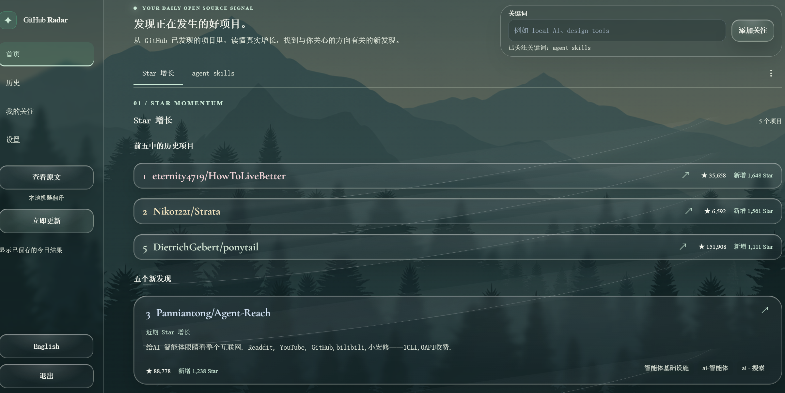
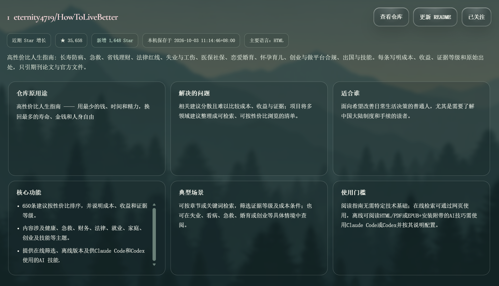
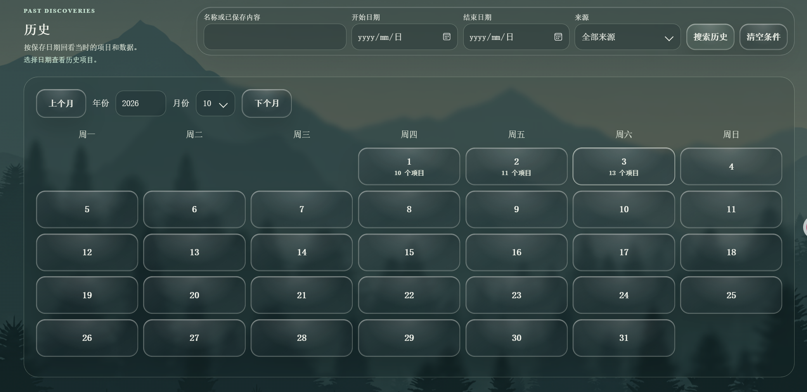
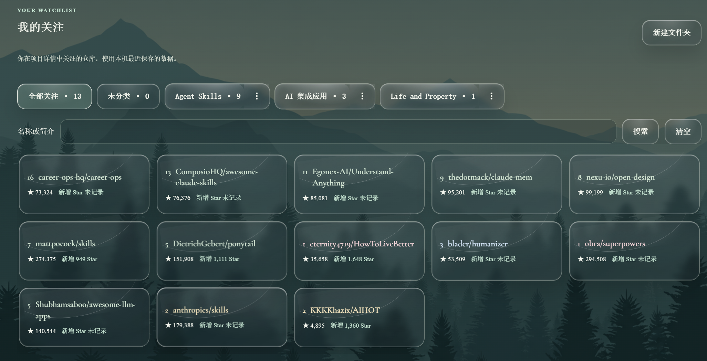
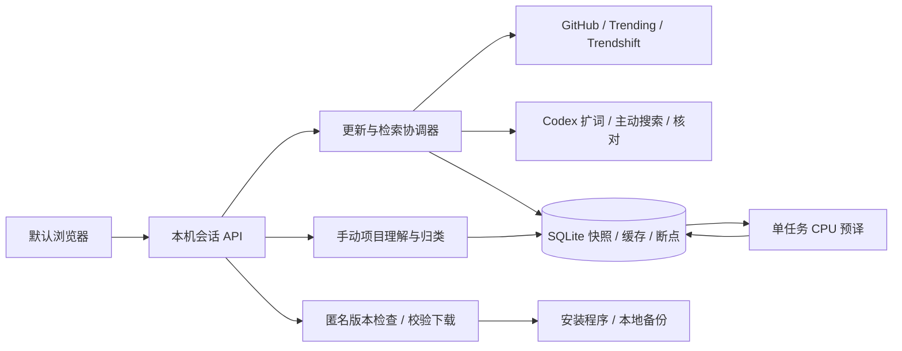

<p align="center"></p>
<h1 align="center">星迹 · StarTrail</h1>
<p align="center">发现开源项目，读懂它能做什么，把值得关注的项目留在本机。</p>
<p align="center">
  <a href="https://github.com/AetheriusLumina/StarTrail/releases">下载 Windows 安装包</a> ·
  <a href="docs/USER_GUIDE.md">用户手册</a> · <a href="docs/DEVELOPMENT.md">开发指南</a> ·
  <a href="https://github.com/AetheriusLumina/StarTrail/issues">反馈问题</a> · <a href="README.en.md">English</a>
</p>
<p align="center"><a href="LICENSE"></a></p>

想找到值得每天打开的 GitHub 项目，也想看懂它到底是什么、能解决什么问题。StarTrail 把**发现、理解、整理**放在一起：优先适配 Windows x64，在默认浏览器阅读，数据保存在自己的电脑。

1. **发现**：多来源收集候选，连接 Codex 后自动扩词、主动联网搜索与核对；增长榜和关键词榜采用不同的真实排序依据。
2. **理解**：六项说明用大白话讲清用途、问题、适用人群、功能、场景和门槛，项目类型放在用途首行高亮。
3. **整理**：按日期回看，关注、搜索、拖动分类，也可以在任何项目详情中创建文件夹并归类。

> [!TIP]
> 安装版自带运行环境与中英离线模型，**本地翻译不消耗 AI 额度**。没有 Codex 连接时可以使用基础发现和阅读；连接后，项目更新会自动运行 AI 搜索与核对，使用自己的账号额度。完整项目理解仍需手动生成。

**阅读导航**：[开始使用](#下载与开始使用) · [创作背景](#这个项目如何诞生) · [功能与界面](#功能与界面) · [数据与隐私](#数据与隐私) · [开发与贡献](#开发与贡献) · [后续方向](#当前限制与后续方向) · [许可证](#许可证与致谢)

## 下载与开始使用

普通用户无需安装 Python、Node.js 或开发工具。

1. 在 [Releases](https://github.com/AetheriusLumina/StarTrail/releases) 下载 **StarTrail_Setup.exe**，同页可下载 SHA256 校验文件与用户手册。
2. 安装后使用桌面快捷方式启动，界面在默认浏览器打开。
3. 点击「立即更新」，添加感兴趣的关键词，在首页分类栏切换增长榜与关键词结果。
4. 打开项目查看详情，按需生成项目理解，再关注或归类；在「历史」「我的关注」继续阅读。
5. 在设置中管理关键词、字号、动效、定时更新、GitHub 账号和 Codex 连接。

<details>
<summary>查看软件升级与数据保留</summary>

1. 软件启动及运行期间检查 GitHub 发布附件；只有发现更高版本的完整安装包及有效 SHA256 时才提示升级。
2. 页面上方提示显示10秒，可手动关闭；侧栏「软件更新」按钮继续保留，点击后查看说明并确认下载。
3. 下载采用流式写入并核对大小和 SHA256，启动安装程序前再次校验。安装程序在停止原程序后备份 `UserData`，再更新软件文件。
4. 自己下载的安装包使用同一升级流程，识别原安装位置并保留数据。旧 GitHub Radar 的兼容标识继续保留。
5. 「立即更新」获取项目数据；「软件更新」升级应用。源码运行通过发布页下载安装包，不覆盖开发目录。安装与恢复说明见 [用户手册](docs/USER_GUIDE.md)。

</details>

## 这个项目如何诞生

最初只是想做一个愿意每天打开的 GitHub 项目阅读工具：找到有意思的项目，读懂用途，再把感兴趣的内容整理起来。

从编程零基础开始，把想法用自然语言说出来，借助 [OpenAI Codex](https://openai.com/codex/) 完成编码与调试。实际打开软件使用，把不对齐、看不懂、反复翻译、更新失败等具体问题连同截图反馈，再讨论原因和修改方式。就这样，从一个想法逐步做出了现在的 StarTrail。

公开源码，希望更多人能直接使用，也方便开发者看懂实现、审查代码、继续改进。

<details>
<summary>展开交流方法与设计取舍</summary>

1. **先说明想解决什么**：围绕发现、理解和整理，逐项明确排名、排重、数据日期和操作规则，不只说「好看一点」。
2. **把反馈落到具体位置**：用实机截图指出间距、字体、抖动和失败提示；先讨论逻辑，再编码并用实际操作核对。
3. **给 AI 明确边界**：保留已有数据和功能，公开资料必须核实，失败不能假装成功，付费调用需要缓存与预算。
4. **让过程可接续**：计划、开发日志、产品接口、回归测试和授权说明集中保存，让下一位开发者或 AI 不必依赖旧聊天。
5. **用工具辅助而不代替验收**：开发过程中使用 [Superpowers](https://github.com/obra/superpowers) 的需求、计划、调试、测试和复核流程，以及 [UI/UX Pro Max](https://github.com/nextlevelbuilder/ui-ux-pro-max-skill)（`ui-ux-pro-max`）处理布局、字体与交互；图像生成和界面检查辅助图标设计与验收。这些是开发工具，不是应用运行依赖。

</details>

## 功能与界面

截图来自实际使用，项目、排名、日期与数字代表当时保存的结果。点击图片可查看大图。

### 1. 发现项目：增长榜与关键词

**增长看日增，关键词看相关性和总 Star。** 两个模块都融合 GitHub、公开趋势来源和 AI 主动搜索，保留可追溯的身份与数据依据。



<details>
<summary>展开两个榜单的检索与排序规则</summary>

1. **增长候选**：公开 GitHub 搜索、近期项目、公开活动样本、跟踪记录、GitHub Trending、Trendshift 与 AI 联网发现互相补充。来源热度用于发现，不代替官方日增数字。
2. **增长核算**：从 GitHub 官方每日统计读取最近已结束的完整 UTC 日，只使用该日的有效正增长；AI 核对仓库身份、日期和指标含义。按日增、总 Star、仓库身份稳定排序。
3. **新发现名额**：增长榜前五中的历史项目紧凑展示，不占五个新项目的名额；沿核实后的排名继续寻找未展示项目。
4. **关键词理解**：保留原词，由 AI 补充少量中英文同义表达和对应 Trendshift 主题；首页可展开查看并纠正扩展词。
5. **关键词发现**：扩展词用于 GitHub 名称、简介、README 搜索，结合趋势页面与 AI 实际联网搜索。官方接口重新读取仓库身份与总 Star，合并同一仓库。
6. **关键词筛选**：先核实实质相关性，再按当前官方总 Star 排名。过滤归档仓库、最低 Star 门槛、过去已经展示和当次其他模块占用的项目；只搜到过的候选不算展示历史。
7. **每天更新与复用**：重新获取当前候选与数字，内容未变的语义判断复用硬盘缓存；新的或改变的内容分批核实。每批最多20个，默认每个模块每天新增核实最多200个，同日重复更新不重置用量。手动继续深度检索可增加最多200个。
8. **缺口与限制**：新结果不足时，在预算内最多补充一次 AI 搜索并重新合并、排名。网络失败、限流、未覆盖分页或候选不足会保留断点和限制；不能保证找到全站全部相关仓库，也不会编造结果补足五个。
9. **页面切换**：查看已保存结果不重新搜索；返回保留原分类。「立即更新」不受定时更新时间限制，同一活动更新复用。

</details>

### 2. 读懂项目：六项关键信息

**仓库原用途、解决的问题、适合谁、核心功能、典型场景、使用门槛**分别介绍。三列两行的等大卡片，长内容在卡片内滚动。



<details>
<summary>展开类型说明、项目理解与归类</summary>

1. 手动生成的 AI 理解用大白话说明，专业术语补充含义；「仓库原用途」首行高亮说明它是软件、Skill、算法、框架、资料或其他类型，依据不足时说明不确定。
2. 没有生成结果时保留可读取的原仓库用途，不伪装成已完成分析。旧理解仍能读取，可手动重新生成以补充类型。
3. 右上角可以查看仓库、更新 README、关注和归类。无论从首页、关键词、历史或关注进入，归类都支持多个已有文件夹或创建并归类；保存归类会加入关注，取消不改数据。
4. 公开 README 与 AI 理解都是阅读辅助，实际安装、权限与使用方法仍应核对原仓库。

</details>

### 3. 回看历史：日期与组合搜索

日历显示每天保存的项目数，点击日期进入当天页；名称、已保存内容、日期范围和来源可以组合搜索。



<details>
<summary>展开快照与搜索规则</summary>

1. 按年份、月份或相邻月份查阅，返回保留浏览位置。
2. 过去的项目使用对应日期快照，不用今天的数字覆盖历史。保存时间来自实际读取，不把复用的旧内容冒充今天重新获取。
3. 搜索直接展示匹配项目，清空条件回到日历；关键词组另起一行，项目采用紧凑卡片。

</details>

### 4. 持续关注：搜索、文件夹与拖动

关注项目用紧凑卡片展示，文件夹与名称或简介搜索配合整理。



<details>
<summary>展开文件夹操作</summary>

1. 「全部关注」「未分类」和自建文件夹显示各自项目数；自建文件夹可排序、重命名和删除。
2. 「全部关注」的项目不拖动；未分类和自建文件夹中的项目都可以拖到目标分类。
3. 自建文件夹之间拖动只移除来源分类，保留其他分类；拖回未分类会清空分类，但保留关注。
4. 删除文件夹保留关注项目。在详情中可以直接多选分类，不需要卡片下方额外的「移动到」按钮。

</details>

### 5. 提前翻译：单任务与硬盘缓存

入选项目在后台分批准备详情译文，内容未变就复用缓存，重复打开或切页不整份重译。

<details>
<summary>展开翻译与资源使用</summary>

1. 只预译入选项目，一次一个本地翻译任务，译文与内容指纹存硬盘，不把全部候选放进内存翻译。
2. 历史项目首次打开可补译，更新后的 AI 理解也可补译；预译不自动生成项目 AI 理解。
3. 详情需要的译文准备后再渐显，减少动画结束后突然换字；代码、链接和仓库标识保留原样。
4. 使用 CPU int8 模型，无需显卡；任务完成后释放工作进程。首次准备和长文处理仍可能需要等待，也可查看原文。

</details>

### 6. 阅读体验：透明主题与短动效

森林背景、透明卡片、菜单与滚动条保持一致，项目标题和排名使用衬线字体。侧栏横向宽度固定，字号增加优先扩展纵向长度。

<details>
<summary>展开阅读与更新设置</summary>

1. 打开、返回与分类切换使用真实页面元素约350毫秒渐显；旧画面直接离开，静态头部不反复重播，可以减少动效。
2. 设置管理字号、动效、关键词、每日更新时间，以及 GitHub 和 Codex 连接。
3. 软件版本消息窗10秒自动关闭，不干扰当前阅读；安装程序的确认独立于项目数据更新。
4. 默认浏览器承载阅读。退出结束本机服务；如果浏览器不允许程序关闭标签页，可自行关闭。

</details>

## 数据与隐私

> [!IMPORTANT]
> 增长榜覆盖本次成功发现并核实的候选，**不是 GitHub 全站实时总榜**。官方日增、累计 Star、趋势网站排序和 AI 判断有不同含义，不能互相替代。

<details>
<summary>查看统计日期与来源边界</summary>

1. 日增采用完整 UTC 日，保存日期采用本机日期。例如北京时间10月4日08:00以后，最近完整统计日是 UTC 10月3日；08:00以前该日尚未结束。
2. GitHub 官方仓库接口提供身份、总 Star 与元数据，官方 Star 统计提供日增；GitHub Trending、Trendshift、公开活动和 AI 搜索扩大候选覆盖。
3. 网站主题与公开趋势不保证穷尽，README 为不可信外部文本，只读取，不执行其中命令。AI 搜索需有实际联网事件，返回的候选还需官方身份解析。
4. 项目理解来自公开资料与模型解释，不是原作者保证；历史来自本机保存记录，不是实时监控。

</details>

<details>
<summary>查看哪些数据联网，哪些留在本机</summary>

| 序号 | 操作 | 数据边界 |
|---|---|---|
| 1 | 历史、关注、文件夹、偏好与译文 | 留在 `UserData`，没有自建云同步服务 |
| 2 | 发现项目、更新 README | 向 GitHub 和公开来源查询关键词、仓库标识等公开资料 |
| 3 | 本地翻译 | 文本在本机 CPU 进程处理，翻译本身不上传云端 |
| 4 | 自动 AI 搜索／核对、手动项目理解 | 公开词和仓库资料发送到连接的 Codex，使用个人账号额度 |
| 5 | GitHub 登录 | 使用设备授权，凭证通过 Windows 账号绑定的加密存储保护 |
| 6 | 软件版本检查与升级 | 匿名访问固定仓库 Releases；不上传个人数据库或日志 |

本机服务只监听回环地址，API 校验会话与来源。不要公开端口，也不要分享 `UserData`、Token、授权文件或完整个人日志。源码提交排除数据库、凭证、环境、构建缓存和私人验收附件，公开文件检查是辅助，提交仍需人工审查。

</details>

## 开发与贡献

采用 **Python 标准库后端 + 原生 HTML/CSS/JavaScript + SQLite**，按职责拆分，保留安装身份与数据兼容。详细环境见 [开发指南](docs/DEVELOPMENT.md)，接口和接续约束见 [AI 开发接续](docs/AI_HANDOFF.md)，工程变更见 [开发日志](docs/CHANGELOG.md)。

<details>
<summary>查看架构与目录入口</summary>



```text
StarTrail/
├── github_radar/           # 兼容旧包名，应用源码
│   ├── __main__.py         # 启动、CLI、维护入口
│   ├── browser_server.py   # 本机会话与 HTTP API
│   ├── service.py          # 更新入口与公开发现兜底
│   ├── search_jobs.py      # 手动、定时、CLI 共用调度
│   ├── search_coordinator.py # 扩词、采集、核对与原子发布
│   ├── search_sources.py   # 多来源与分区分页
│   ├── search_provider.py  # AI 扩词、联网发现、证据核对
│   ├── search_storage.py   # 候选、缓存、额度、断点与租约
│   ├── search_ranking.py   # 两个榜单的纯排序规则
│   ├── storage.py         # SQLite 迁移、快照、历史与关注
│   ├── follow_folders.py  # 拖动与原子归类
│   ├── ai_service.py      # 手动项目理解
│   ├── project_translation.py # 入选项目预译
│   ├── software_update.py # 固定仓库升级与 SHA256
│   └── web_assets/        # HTML、CSS、JS、字体与图标
├── tests/                 # 隔离回归、Node 与 Windows 验收
├── scripts/               # 模型准备、公开检查、授权收集
├── requirements/          # 依赖约束
├── packaging/             # PyInstaller、Inno、模型清单
├── docs/                  # 手册、接口、日志、授权和截图
├── .github/               # 只读检查、手动构建与反馈模板
├── pyproject.toml
└── LICENSE
```

翻译使用 Argos 来源的中英模型、CTranslate2 与 SentencePiece；冻结应用使用 PyInstaller，Windows 安装使用 Inno Setup。来源与资源授权集中在 [第三方说明](docs/THIRD_PARTY_NOTICES.md)。

</details>

<details>
<summary>展开启动、测试与发布</summary>

1. 开发环境：Windows x64、Python 3.13、Node.js 22+、Git。安装版用户不需要这些工具。
2. 使用独立开发数据，不连接日常数据库；自动回归使用合成资料，不需要私人凭证或付费 AI。

```powershell
git clone https://github.com/AetheriusLumina/StarTrail.git
cd StarTrail
py -3.13 -m venv .venv
.\.venv\Scripts\python -m pip install -c requirements/constraints.txt -e ".[translation,build]"
.\.venv\Scripts\python scripts/prepare_models.py
.\.venv\Scripts\python -m github_radar --data-dir .build/DevelopmentData
```

```powershell
$env:RADAR_TEST_PYTHON = (Resolve-Path .venv/Scripts/python.exe).Path
.\.venv\Scripts\python -m unittest discover -s tests
node tests/software_update_ui.cjs
.\.venv\Scripts\python scripts/check_public.py --tracked
git diff --check
```

3. 使用官方 Inno Setup 6，运行 `pwsh -File packaging/build.ps1`，产物集中在 `.build`。打包、模型与依赖检查详见开发指南。
4. 普通提交和 PR 仅运行只读检查；有权限的人手动触发 Windows 构建发布，测试、公开文件与附件摘要校验通过后才发布指定标签。
5. 欢迎提交问题、修正文案、完善翻译、代码审查和性能改进。较大逻辑先讨论，PR 写清行为、验证和限制；不要上传私有数据。

</details>

## 当前限制与后续方向

1. 优先支持 Windows x64；macOS、Linux、ARM 和移动端仍需适配。安装包尚未代码签名，干净电脑与长期运行覆盖需要持续扩充。
2. 外部接口可能限流、延迟或改变。有限预算内尽量扩大覆盖，失败保留结果和断点，不承诺全站无遗漏。
3. AI 理解与机器翻译都可能出错；本地模型会使用磁盘和短时内存，长 README 的质量与性能仍需改善。
4. 后续优先完善兼容、性能、来源适配和有边界的模块拆分，欢迎一起验证和改进。

## 许可证与致谢

自有代码和文档采用 [MIT](LICENSE)，允许使用、修改和分发，并保留许可说明。字体、模型、背景与运行库保留各自授权，见 [第三方说明](docs/THIRD_PARTY_NOTICES.md)。原创猫形星光图标不是 GitHub 官方 Octocat 商标。

感谢相关开源工具、资源项目，以及公开资料的仓库作者。
